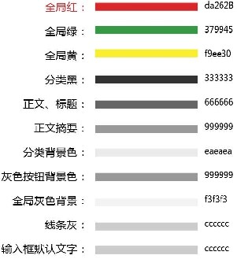

# 开发准备

---
## 1 项目启动

一个好的项目应该从一开始就规划好。

1. 开发不只是敲代码的，在项目启动之初，在原型设计与 UI 设计中就应该参与进去，提供自己在平台角度上的建议，比如将作为 Android App 设得和 IOS 的一模一样。个人感觉开发起来是比较痛苦的，由于产品或者设计可能不是特别了解平台差异性或一些其他原因，我们最好从一开始就参与进去，不好的设计(或者其他东西)应该商量是否可以修改或者去除掉。

2. 做了几个 app 后，感觉后台的数据规范化非常重要，定义必须字段，定义统一的格式，后台的接口开发人员字段命名要统一等等，这样可以在一定程度上减轻移动端 app 开发的困难。

一般都流程应该是：

- 确认需求
- 开会进行需求讲解与原型设计讲解原型设计
- 开会进行需求讲解与原型设计讲解(统一意见)
- ui设计与切图（切几套？什么分辨率？）
- ui问题反馈
- 定制开发计划与正式开发

---
## 2 项目开发

### 2.1 原型与UI方面

- 产品出原型、UI出设计、开会审核，避免不好的设计和不合理的需求。
- app风格统一
  - 确认 app 主色调，以及 app 色调范围(不要各种颜色乱用)。
  - 规范一些通用的尺寸，如内容区域与屏幕边缘距离、行距等。
  - 确定颜色表、通用 size 表。
- 可点击的控件，标志各种状态颜色。等等各个细节问题
- 规范字体与字体大小
- UI切图，切几套图，主要适配哪些分辨率。

app色调模板示例：



原型审核标准，审核哪些方面，粒度如何：

- 列表多类型 Item 的各种情况是否全覆盖。
- 业务流程是否完整清晰。
- 页面架构是否合理，复杂逻辑放在 Dialog 还是新的界面。Dialog 一般是不稳定的 UI 元素。
- 能不能实现是一个问题，实现的难度与用着舒不舒服是一个问题。

### 2.2 后台接口规范

- 接口的安全性，token 机制，与各种签名算法。
- 熟悉服务器后台通信流程与规范，反馈接口问题。
- 定义必要字段。
- 同一个接口在成功与失败时不要返回不同的数据模型。
- 数据类型必须按照约定返回，**如果后台是 PHP**，尤其需要规范，因为 PHP 之类的弱类型语言不注意规范的话会给 Java 数据解析造成麻烦。

#### json

以 json 为例

```json
    {
     "resultCode": 0,//状态码，0表示成功，非0表示各种不同的错误
     "resultMessage": "成功",// 描述信息，成功时为"success"，错误时则是错误信息
     "data": {}//成功时返回的数据，类型为对象或数组
    }
```

- 定义`resultCode`和`resultMessage`为必须字段，无论什么情况都需要返回，其他数据放在`data`中根据各种业务定义。
- 非必需字段可以不返回，如果要返回就必须是正确的类型，比如某个 int 类型的数据在没有值时返回 `""` 空字符是不对的。

接口的数据类型规范：

```json
    number
    string
    boolean
    object
    array
    map
    null
```

数据解析时的容错处理：在开发中我们一般都会选用自动解析框架，比如 Gson，但是使用框架也有一些问题，比如 json 中的某一个字段解析出错就会导致整个数据模型解析出错，如果能够做一些容错处理，则能提高程序的可用性，使用 Gson 我们可以注册自定义的解析器来做容错处理，参考下面代码：

```java
            Gson sGson = new GsonBuilder()
            .excludeFieldsWithModifiers(Modifier.TRANSIENT)
            .excludeFieldsWithModifiers(Modifier.STATIC)
            .registerTypeAdapter(String.class, (JsonDeserializer<String>) (json, typeOfT, context) -> {
                try {
                    return json.getAsString();
                } catch (Exception e) {
                    System.out.println("StringJsonDeserializer-deserialize-error:" + (json != null ? json.toString() : ""));
                    return null;
                }
            })
            .registerTypeAdapter(Unit.class, (JsonDeserializer<Unit>) (src, typeOfSrc, context) -> Unit.INSTANCE)
            .registerTypeAdapter(Void.class, (JsonDeserializer<Void>) (src, typeOfSrc, context) -> null)
            .create();
```

### 2.3 App开发

- 编码规范很重要，人员交流也很总要，不要等到某某模块开发完了才说这里不行，那里不行，先思考先商量再做事。
- 根据项目业务等搭建 app 整体架构与确定第三方公共库
- 第三方账号准备(包括社会化分享，第三方登录，支付，消息推送，统计，上线、性能监控、内存监控等)
- 项目人员共同学习开发编码规范与项目架构
- 确认 app 兼容版本与 UI 适配范围
- 统一 bug 管理
- APM

关于第三方平台，比如消息推送，需要说明一点，一定要对其做再封装，不要强依赖其类库和数据格式，以方便后面可能的框架替换。
