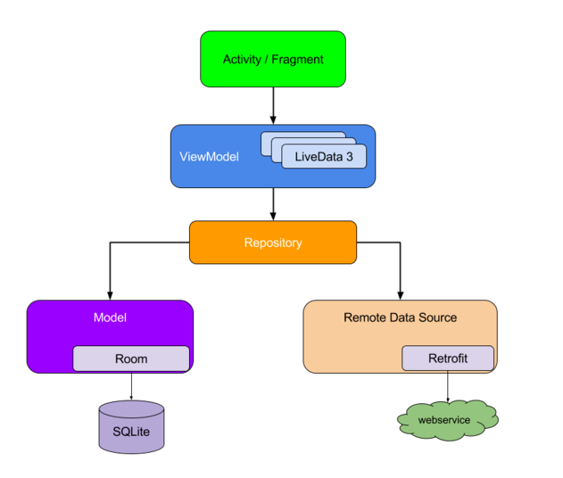

# 认识架构

整体架构的定义是：对于一个目标系统的边界进行界定，并对目标系按照某个原则进行**切分**，切分的原则要便于不同的角色对切出来的部分并行或串行的开展工作(一般并行才能减少时间)，并对这些切出来的部分设立**沟通机制**。使得这些部分之间能够进行**有机的联系**，合并组装成为一个整体，完成目标系统的所有工作。

App 架构目的都是**`松耦合，可测试，稳定性，可扩展性，可维护性`**。实现途径是个体的职责单一与功能简化。就是无论是按照 MVP 还是 MVVM，都是为了解除V和M之间的耦合，MV 是不变的，M和 V 如何交互就是 P、VM 或者其他实现的事了。

对App系统的进行职责切割应该是比较明确的，但是对于切割出来的部分如何有效的进行交互，并且还要考虑到Android组件的生命周期。就是比较麻烦的事情了。

总的来说 App 大致应该有如下层次划分：

- UI 层：Fragment、Widget 和 Views 实现 UI 展示，关注交互体验
- 逻辑层：比如 MVP 中的 P 或者 MVVM 中的 VM，这一层担任的职责是协调 M 和 V 通信
- 业务层：此层用于实现业务逻辑，然后还有网络或者缓存数据的获取与存储
- 底层第三方库，业务无关，每个库应该高内聚，各个库之间应该无耦合或者低耦合。每个库应该以组件的方式集成。

参考 [android-architecture-component](https://github.com/googlesamples/android-architecture-components) 的架构图

架构图中将业务层使用了 Repository 模式，Repository 屏蔽了数据的具体来源，对本地缓存和远程数据做了统一的封装。

---
## 引用

- [架构漫谈](http://q.infoqstatic.com/ppt/Informal-Discussion-on-Architecture.pdf)
