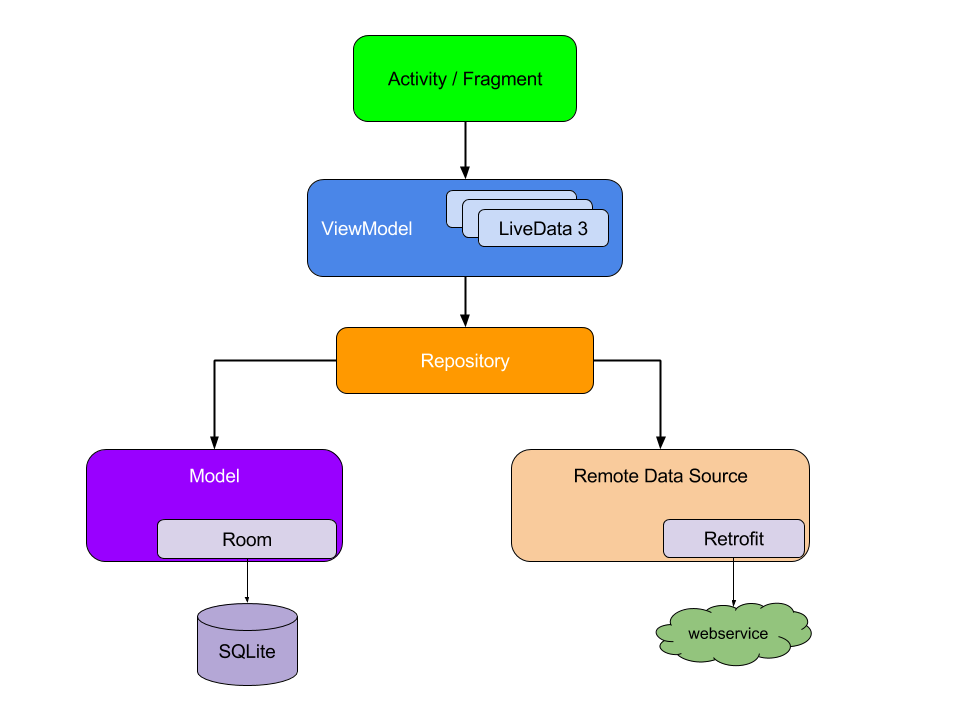

# Android Architecture Components

---
## 1 Android Architecture Components Overview

**Android Architecture Components** 是Google提供的一个Android开发基础框架，并提供了一些架构设计上的建议。

Components主要包括以下组件：

- **Lifecycle-aware**：生命周期感知组件，提供了对Android组件(Activity、Service)和Fragment的生命周期的感知(监听)能力。其他对象通过注解方式式(或Java8的接口方式)来感知Android组件的生命周期变化。
- **ViewModel**：提供了ViewModel抽象类，作为数据与UI的绑定者，ViewModel自动监听了UI(Activity或Fragment)的生命周期，当UI销毁时，它也会自动销毁。
- **LiveData**：是一个可被观察的数据持有者。它让应用中的组件观察自己的变化，却不需要显式的和刚性的依赖。LiveData同时会监听应用组件（Activity，Fragment，Services）的生命周期状态，用于防止对象的内存泄露。
- **Room**：注解式的ORM数据库框架，并且提供了类似Retrofit的注解式Dao。
- **Paging**：分页库使应用程序更容易从数据源逐步加载所需的信息，而不会使设备过载或等待太长加载时间。

---
## 2 设计规范(Guide to App Architecture)

### 2.1 应用开发者面临的常见问题(Common problems faced by app developers)

与传统的桌面应用开发不一样，在大多数情况下，在应用启动的快捷方式中拥有一个单一的入口并且当前应用会作为**monolithic process**运行。Android应用程序具有更复杂的结构。一个典型的Android应用程序是由多个应用程序组件构成的，包括activities, fragments, services, content providers 和 broadcast receivers.

>单片应用：单片系统在计算机软件和硬件环境中可以具有不同的含义。如果软件系统具有单片架构，则称其为“单片”，其中功能上可区分的方面（例如数据输入和输出，数据处理，错误处理和用户界面）全部交织在一起，而不是包含架构上分离的组件。

大多数这些应用程序组件都是在Android操作系统使用的 Manifest 中声明的，以决定如何将应用程序与其设备的整体用户体验相集成。虽然如前所述，桌面应用程序传统上是作为一个整体过程运行的，编写Android应用程序需要更加的灵活，因为用户通过设备上的不同应用程序组织他们的操作方式，不断切换流程和任务。

比如一个分享照片的行为，用户在App中通过进入相机APP拍取照片，然后回到当前应用处理照片结果，然后触发其他社交App并把照片传递过去完成分享，最终返回到当前应用，这一系列动作对于用户来讲，是连贯的，就好像是一个单一的连续的行为，然后对应我们来讲，这一行为却通过三个应用的组件协作完成。

在Android中，这种应用程序跳转行为很常见，应用程序必须正确处理这些流程。请记住，移动设备资源受限，因此操作系统在任何时候都可能需要杀死一些应用程序才能为新设备腾出空间。

所有这一切都意味着应用程序组件可以单独和无序地启动，并且可以在任何时候由用户或系统销毁。因为应用程序组件是短暂的，并且它们的生命周期（当它们被创建和销毁时）不受你的控制，你不应将任何应用程序数据或状态存储在你的应用程序组件中，并且你的应用程序组件不应相互依赖。

总结：

- Android系统中应用程序作为 **monolithic process** 运行
- 应用组件具有复杂的生命周期
- Android中的组件的生命周期不受开发者控制，系统或用户随时可能销毁掉它们
- Android系统中，用户的一组操作可能需要跨越多个App组件来完成，所以这意味着应用程序组件可以单独和无序地启动

### 2.2 通用架构原则(Common architectural principles)

如果无法使用应用程序组件来存储应用程序数据和状态，应该如何构建应用程序？

最重要的事情是在应用程序开发中的 **关注点分离**，将所有代码写入Activity或Fragment是一种常见的错误，尽可能保持精简可以避免许多生命周期相关的问题。不要忘记，你不拥有这些类，它们只是体现操作系统和你的应用程序之间契约的胶合类。任何不处理UI或操作系统交互的代码都不应该在这些类中，基于用户交互或其他因素（如低内存），Android操作系统可能随时销毁它们。最好尽量减少对它们的依赖，以提供可靠的用户体验

第二个重要原则是你应该 **Model驱动UI**，最好是一个持久Model。持久化非常理想，原因有两个：1 如果操作系统销毁你的应用程序以释放资源，你的应用程序即使在网络连接状况不佳或未连接时，你的用户也不会丢失数据。2 Model是负责处理应用程序数据的组件。它们独立于应用中的视图和应用组件，因此它们与这些组件的生命周期问题是隔离的。这可以保持UI代码简单并且没有业务逻辑，使得UI更易于管理。将业务逻辑放在Model类上，让Model承担明确的数据管理责任。

总结：

1. 移动设备资源有限，操作系统随时会杀死一些应用程序来腾出空间给新的应用。所以应用程序组件的存在不由开发者控制，不应该 **存储数据或状态**，更不应该 **彼此依赖**。
2. 使Activity和Fragment中的代码尽可能的少，只处理UI或与操作系统相关的交互。因为这些类是操作系统和应用程序的中间件，不由开发者控制，所以应该最小化依赖。
3. **持久化模型独立于组件，不受系统的控制**。通过持久化模型驱动界面，具有两点好处：
   - 当操作系统释放组件资源时，用户数据也不会丢失。
   - 当网络连接状态不好时，应用程序也能正常工作。

### 2.3 推荐的UI架构(Recommended app architecture)

>没有一个万能的应用程序架构，这只是一个建议，如果你已经有一个通用应用程序架构，你不需要改变你的架构。

#### 2.3.1 构建用户界面

由Activity和Fragment承载UI交互，而不处理复杂的业务逻辑，通过注入或者其他方式把承载数据的ViewModel提供给Activity和Fragment。

- 使用Activity或Fragment构建界面
- 使用ViewModel承载UI数据，UI持有ViewModel的引用，而ViewModel不能持有UI的引用
- UI通过ViewModel提供的使用可观察的LiveData观察数据变化，来更改UI状态
- ViewModel和LiveData都是可感知生命周期的
- LiveDataReactiveStreams 提供了转换响应式流(比如RxJva2)和LiveData的相互转换功能，注意 **`LiveDataReactiveStreams.fromPublisher`** 并没有处理 Publisher 的 onError，我们需要在调用 fromPublisher 之前利用相关操作符把 onError 的情况处理掉。

#### 2.3.2 获取数据

一个ViewModel给一个特定的界面组件（Activity或Fragment）提供数据，并处理业务逻辑中数据相关的操作，ViewModel与View层分离，不持有View的引用，而且不会被配置改变(比如屏幕旋转)影响,ViewModel与Presenter最大的不同是，Presenter内部封装着 **一系列的行为**，而ViewModel持有的是 **数据（状态）**，由ViewModel暴露方法提传递数据到View层。

直接返回可观察的数据

- 如何将数据提供给View层呢？最好是选择LiveData(`RxJava或Agera`也是不错的选择)的方式，因为这些库都可以直接返回包装了数据的可观察对象(这样就避免了各种复杂的回调)，当然使用这些库要处理好与组件生命周期的绑定与注销。
- LiveData是一个可被观察的数据持有者。它让应用中的组件观察自己的变化，却不需要显式的和刚性的依赖。LiveData同时会监听应用组件（Activity，Fragment，Services）的生命周期状态，并且做正确的事情来防止对象的内存泄露。

总结：

- ViewModel中不应该直接操作WebService来获取数据，这样会造成ViewModel的逻辑过于复杂。
- ViewModel是与Activity或Fragment生命周期相关联的，因此在生命周期结束时丢失用户所有数据是不好的用户体验。
- ViewModel应该将把这项工作委托给一个新的Repository模块。
- Repository模块负责处理数据操作。他们为应用程序的其他部分提供了一个干净的API，他们知道从何处获取数据以及在更新数据时调用哪些API。可以将它们视为不同数据源（持久模型，Web服务，缓存等）之间的中介。
- Repository模块负责所有的业务数据操作，这对上层来讲是透明的，ViewModel不需要关心数据的来源。

##### Repository概念

ViewModel不直接从网络或者本地获取数据，因为ViewModel始终与UI组件(Activity和Fragment)关联，当UI组件销毁后，ViewModel也会被销毁，这样数据就完全丢失了，而Repository是专门用来处理数据操作的，数据可以从 **内存、数据库、网络** 获取数据，而ViewModel并不需要关心这些不同的数据源，而是由Repository提供封装后的唯一数据源。

#### 2.3.3 连接ViewModel和Repository

Repository模块的实例化是复杂的，这工作不应该交给ViewModel，可以通过依赖注入或者服务定位器模式来获取Repository实例。Repository最好以注入的方式(Dagger2是不错的选择)提供给ViewModel，使用Repository的好处是数据源与应用组件独立开来了，方便替换和测试时的mock

#### 2.3.4 缓存数据和持久化数据

Repository作为抽象的单一数据源，但其内部一般包含另外三个具体的数据源：网络、内存、本地持久层，若Repository只实现一个数据源，则会显得不太实用。需增加数据的持久层，当用户再次进入界面时不用重新加载，不然会浪费宝贵的网络带宽和迫使用户等待新的请求。可以使用Room来作为数据持久化库。

两种数据缓存：

- 使用内存缓存，从内存获取缓存，非常高效，但是当进程被杀死后就会导致缓存丢失，且内存缓存也占用了一些内存空间
- 使数据持久化，把网络数据缓存到数据库(或文件)中，即使进程没杀死或者没有网络的时候，应用也具有一定的可用性。

如何合并多个数据源：

1. 问题是当场景是通过两个不同类型的请求来获取相同类型的数据时，会出现显示不一致的问题，导致需手动合并它们。正确的做法是数据持久化，在数据库中完成合并操作。
2. **单一数据源原则**，不同的后端接口返回相同的数据（粒度可能不同）是一种常见情况，但在请求的间隙，服务端的数据可能发生改变。若Repository直接返回网络请求，则导致界面显示冲突。可以把网络请求的数据应该仅仅存到数据库中，然后触发LiveData的刷新。这样，数据库服务作为单一数据源，应用程序的其它部分通过 Repository 来访问它。无论是否是否磁盘缓存，建议 Repository 指定一个数据源作为应用程序其它部分的单一数据源。
3. 单一数据源原则需要解决的问题
   - 数据的分页加载问题，当页面请求是一个加载更多时，如果处理好针对某一页数据触发更新
   - 防止不必要的触发，当网络数据没有更新时(此时数据库已有对应的缓存)，此时把针对数据库的动作不会触发更新
   - 如何把加载的状态反馈到UI层，比如 **网络错误、服务器错误、没有新的数据**

不得不说：使用Repository和单一数据源原则，**降低了ViewModel的复杂程度**

#### 2.3.5 测试规范

- Activity 和 Fragment 等组件：这是唯一使用设备界面测试的地方。提供一个 mock 的 ViewModel
- ViewModel：通过 JUnit 即可测试，mock 所需的 Repository
- Repository：通过JUnit测试，mock 所需的 Webservice 和 Dao (或其他存储方式的访问器)
- Repository或ViewModel中用到的平台相关的对象都应该是可以被注入的，而不应该是硬编码的，这样在使用Junit时才能注入mock的对象

#### 2.3.5 最终加载架构



### 2.4 指导原则(Guiding principles)

编程是一个创作领域，构建 Android 应用也不例外。有许多方法来解决问题，无论是在多个 activity 或 fragment 之间传递数据，是获取远程数据并为了离线模式将其持久化到本地，还是特殊应用遭遇的其它常见情况。

虽然以下建议不是强制性的，但我们的经验是，遵循这些建议将使你的代码基础更加健壮，可测试并可长期维护。

- 在清单中定义的入口点acitivy，fragment，broadcast receiver等不是数据的来源。相反，它们只应该协调与该入口点相关的数据子集。
- 在应用程序的各个模块之间创建明确界定的责任，比如不要将加载网络数据的代码分布到代码库中的多个类或包中，同样，不要将不相关的职责——例如数据缓存和数据绑定放到同一个类中。
- 尽可能少地暴露每个模块。
- 在定义模块之间的交互时，请考虑如何让每个模块单独进行测试。
- 明确你的应用程序的核心是什么，让它从其他中脱颖而出。不要花太多时间重复发明轮子或一次又一次地写出相同的样板代码。
- 尽可能多地保留新的数据，以便在设备处于离线模式时可以使用您的应用程序。
- Repository应该指定一个数据源作为单一的数据源。只要应用程序需要访问这部分数据，数据应该始终来自单一的数据源。

### 2.5 暴露网络状态

#### 封装数据和网络状态

Resource是一个通用的类，用于分发数据和状态，Repository可以返回了包括状态和数据的Resource对象。

```java
public class Resource<T> {

    @NonNull public final Status status;
    @Nullable public final T data;
    @Nullable public final String message;

    private Resource(@NonNull Status status, @Nullable T data, @Nullable String message) {
        this.status = status;
        this.data = data;
        this.message = message;
    }

    public static <T> Resource<T> success(@NonNull T data) {
        return new Resource<>(SUCCESS, data, null);
    }

    public static <T> Resource<T> error(String msg, @Nullable T data) {
        return new Resource<>(ERROR, data, msg);
    }

    public static <T> Resource<T> loading(@Nullable T data) {
        return new Resource<>(LOADING, data, null);
    }
}
```

#### 封装整体流程

从磁盘中获取并显示数据同时再从网络获取数据是一种常见的用例。可以创建一个可以在多个地方使用的帮助类 `NetworkBoundResource`。下面是 NetworkBoundResource 的决策树:


NetworkBoundResource内部封装了统一的流程，用于从数据库和网络加载数据，然后返回一个用LiveData包装的Resource对象，NetworkBoundResource定义了两个类型参数ResultType和RequestType。因为从API返回的数据类型可能与本地使用的数据类型不匹配。

1. 分发一个loading状态
2. 首先从数据库加载数据
3. 根据本地数据判断是否应该加载网络数据
4. 如果不需要从网络加载则直接使用数据库的数据
5. 如果需要从网络加载
    1. 先展示数据库的数据，然后再去加载网络数据
    2. 从网络加载成功，保存数据到数据
    3. 重新绑定数据，从数据库加载网络更新

最后，UI始终与数据库绑定，后续的从网络加载更多只需要把数据更新到数据库即可。因为数据库会自动触发更新。

```java
public abstract class NetworkBoundResource<ResultType, RequestType> {

    //异步加载器
    private final AppExecutors appExecutors;

    //中间人，用于连接网络的LiveData和数据库的LiveData到上层
    private final MediatorLiveData<Resource<ResultType>> result = new MediatorLiveData<>();

    @MainThread
    NetworkBoundResource(AppExecutors appExecutors) {
        this.appExecutors = appExecutors;
        //分发一个loading状态
        result.setValue(Resource.loading(null));
        //首先从数据库加载数据
        LiveData<ResultType> dbSource = loadFromDb();
        //观察数据库加载结果
        result.addSource(dbSource, data -> {
            result.removeSource(dbSource);//移除观察
            //根据本地数据判断是否应该加载网络数据
            if (shouldFetch(data)) {
            //从网络加载数据
                fetchFromNetwork(dbSource);
            } else {
            //直接使用数据库的数据
                result.addSource(dbSource, newData -> setValue(Resource.success(newData)));
            }
        });
    }

    @MainThread
    private void setValue(Resource<ResultType> newValue) {
    //如果数据发生了改变，则通知重新设置
        if (!Objects.equals(result.getValue(), newValue)) {
            result.setValue(newValue);
        }
    }

    private void fetchFromNetwork(final LiveData<ResultType> dbSource) {
        //创建一个网络请求
        LiveData<ApiResponse<RequestType>> apiResponse = createCall();
        // we re-attach dbSource as a new source, it will dispatch its latest value quickly
        // 这里先展示数据库的数据，然后再去加载网络数据，这是一个常见的优化，不然用户等待。
        result.addSource(dbSource, newData -> setValue(Resource.loading(newData)));

        //去加载网络数据
        result.addSource(apiResponse, response -> {
            //加载完成
            result.removeSource(apiResponse);//移除观察者
            result.removeSource(dbSource);//移除观察者
            //noinspection ConstantConditions
            if (response.isSuccessful()) {//成功
                appExecutors.diskIO().execute(() -> {
                //保存到数据库
                    saveCallResult(processResponse(response));
                    appExecutors.mainThread().execute(() ->
                            // we specially request a new live data,
                            // otherwise we will get immediately last cached value,
                            // which may not be updated with latest results received from network.
                            //数据已经更新了，重新从数据库加载(其实就是网络请求完成的数据，单一数据源设计)
                            result.addSource(loadFromDb(),
                                    newData -> setValue(Resource.success(newData)))
                    );
                });
            } else {//失败，发送失败信息
                onFetchFailed();
                result.addSource(dbSource,
                        newData -> setValue(Resource.error(response.errorMessage, newData)));
            }
        });
    }

    protected void onFetchFailed() {
    }

    public LiveData<Resource<ResultType>> asLiveData() {
        return result;
    }

    @WorkerThread
    protected RequestType processResponse(ApiResponse<RequestType> response) {
        return response.body;
    }

    @WorkerThread
    protected abstract void saveCallResult(@NonNull RequestType item);

    @MainThread
    protected abstract boolean shouldFetch(@Nullable ResultType data);

    @NonNull
    @MainThread
    protected abstract LiveData<ResultType> loadFromDb();

    @NonNull
    @MainThread
    protected abstract LiveData<ApiResponse<RequestType>> createCall();
}
```

去掉核心代码，NetworkBoundResource提供了以下API

- `void saveCallResult(@NonNull RequestType item);`调用该方法将 API 响应的结果保存到数据库中。
- `boolean shouldFetch(@Nullable ResultType data);`调用该方法判断数据库中的数据是否应该从网络获取并更新。
- `abstract LiveData<ResultType> loadFromDb();` 调用该方法从数据库中获取缓存数据。
- `abstract LiveData<ApiResponse<RequestType>> createCall();` 调用该方法创建 API 请求。
- `void onFetchFailed()` 获取失败时调用。
- `final LiveData<Resource<ResultType>> getAsLiveData()` 返回一个代表 Resource 的 LiveData。

NetworkBoundResource通过观察资源的数据库。当首次从数据库加载条目时，检查返回结果是否足够好可以被发送和（或）应该从网络获取数据。或者它们可能同时发生，因为可能会希望在显示缓存数据的同时从网络更新数据。如果网络调用成功，则将返回数据保存到数据库中并重新初始化数据流。如果网络请求失败，直接发送一个错误。

将新的数据保存到磁盘后，要从数据库重新初始化数据流，但是通常不需要这样做，因为数据库将会发送变更。另一方面，依赖数据库发送变更会有一些不好的副作用，因为在数据没有变化时如果数据库会避免发送更改将会使其中断。我们也不希望发送从网络返回的结果，因为这违背的单一数据源原则（即使在数据库中有触发器会改变保存值）。我们也不希望在没有新数据的时候发送 SUCCESS，因为这会给客户端发送错误信息。

现在，可以使用 NetworkBoundResource 在 Repository 中编写磁盘和网络绑定 User 的实现，具体代码参考官方的Github项目。

---
## 引用

- [Guide to app architecture](https://developer.android.com/jetpack/docs/guide)
- [Guide to app architecture cn](https://developer.android.com/jetpack/docs/guide?hl=zh-cn)
- [android-architecture-components-sample](https://github.com/googlesamples/android-architecture-components)