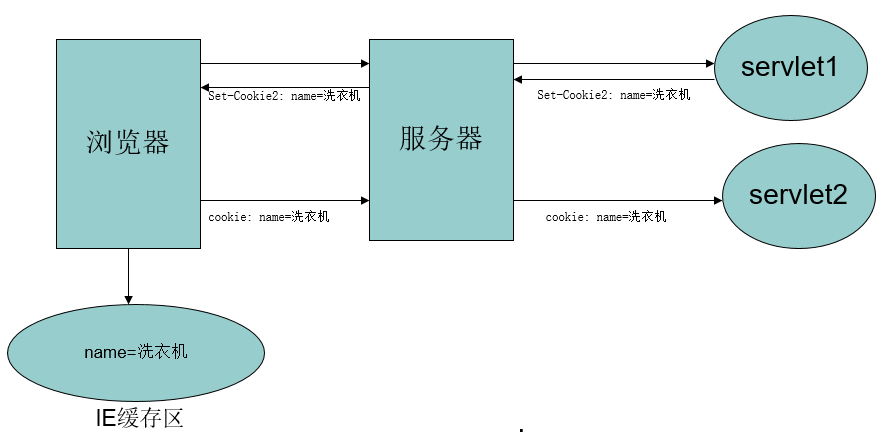
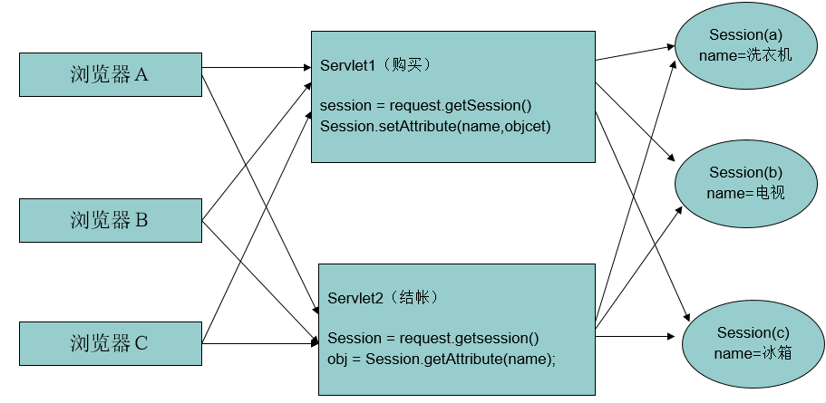
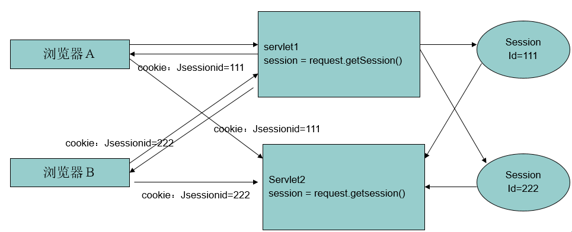
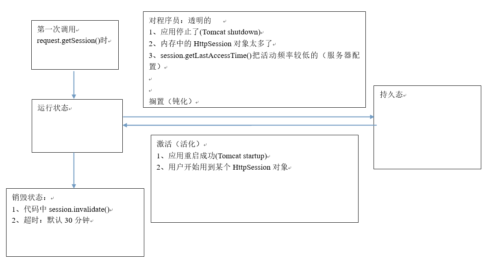

# 会话管理

**什么是会话**？会话可简单理解为：用户开一个浏览器，点击多个超链接，访问服务器多个web资源，然后关闭浏览器，整个过程称之为一个会话。

**会话过程中要解决的一些问题**？每个用户在使用浏览器与服务器进行会话的过程中，不可避免各自会产生一些数据，程序要想办法为每个用户保存这些数据。例如：用户点击超链接通过一个servlet购买了一个商品，程序应该想办法保存用户购买的商品，以便于用户点结帐servlet时，结帐servlet可以得到用户购买的商品为用户结帐。

由于**HTTP是无状态的通讯**，需要使用会话技术保存用户操作产生的数据，会话技术包括：Cookie和Session。

---
## 1 Cookie

Cookie是客户端技术，程序把每个用户的数据以cookie的形式写给用户各自的浏览器。当用户使用浏览器再去访问服务器中的web资源时，就会带着各自的数据去。这样，web资源处理的就是用户各自的数据了。



### Cookie属性

`javax.servlet.http.Cookie`类用于创建一个Cookie，response接口中定义了一个addCookie方法，它用于在其响应头中增加一个相应的`Set-Cookie`头字段。 同样，request接口中也定义了一个`getCookies`方法，它用于获取客户端提交的Cookie。

Cookie的属性如下：

- name(必须)：Cookie的名字
- value(必须)：Cookie的取值，单一值
- path(可选)：路径，默认是Cookie的所属程序的URI路径
- domain(可选)：域名，默认是写Cookie那个程序所属的网站域名。
- maxAge(可选)：存活的时间，默认是浏览器的内存。单位为秒。如果设置为0，浏览器则删除该Cookie(注意路径要一致)。
- version(可选)：版本号
- comment(可选)：注释说明

如何唯一确定一个Cookie：`domain+path+name`，关于Cookie的Path有如下规则：比如servlet的路径是`http://localhost:8080/app/servlet/ShowLastAccessTimeServlet`，则默认路径是：`/app/servlet/`，如果当前访问的URL地址`.startWith(已存Cookie的path)`，是则客户端会把Cookie带给服务器。

Cookie针对其属性提供了操作的方法，Cookie常用方法如下：

- `Cookie(String name,String value)`：构造方法
- `setValue()`与`getValue()`方法：
- `setMaxAge()`与`getMaxAge()`方法：设置Cookie的有效时间，(单位为秒)
- `setPath()`与`getPath方法()`：设置/获取Cookie对用的Path
- `setDomain()`与`getDomain()`方法
- `getName()`方法

### Cookie细节

- 一个Cookie只能标识一种信息，它至少含有一个标识该信息的名称（NAME）和设置值（VALUE）。
- 一个WEB站点可以给一个WEB浏览器发送多个Cookie，一个WEB浏览器也可以存储多个WEB站点提供的Cookie。
- 浏览器一般只允许存放300个Cookie，每个站点最多存放20个Cookie，每个Cookie的大小限制为4KB。
- 如果创建了一个cookie，并将它发送到浏览器，默认情况下它是一个会话级别的cookie（即存储在浏览器的内存中），用户退出浏览器之后即被删除。若希望浏览器将该cookie存储在磁盘上，则需要使用maxAge，并给出一个以秒为单位的时间。将最大时效设为0则是命令浏览器删除该cookie。
- 注意，删除cookie时，path必须绝对一致，否则不会删除
- cookie中不能存中文数据

---
## 2 Session

Session是服务器端技术，利用这个技术，服务器在运行时可以为每一个用户的浏览器创建一个其独享的HttpSession对象，由于session为用户浏览器独享，所以用户在访问服务器的web资源时，可以把各自的数据放在各自的session中，当用户再去访问服务器中的其它web资源时，其它web资源再从用户各自的session中取出数据为用户服务。



在WEB开发中，服务器可以为每个用户浏览器创建一个会话对象（session对象），注意：一个浏览器独占一个session对象(默认情况下)。因此，在需要保存用户数据时，服务器程序可以把用户数据写到用户浏览器独占的session中，当用户使用浏览器访问其它程序时，其它程序可以从用户的session中取出该用户的数据，为用户服务。

Session和Cookie的主要区别在于：Cookie是把用户的数据写给用户的浏览器。而Session技术把用户的数据写到用户独占的session中。

Session对象由服务器创建，开发人员可以调用request对象的getSession方法得到session对象。

### session实现原理

session相当于一个会话(IE浏览器可以新建一个会话，那么同一个浏览器的两个会话，它们的session也是不同的)。



`request.getSession()`的内部逻辑：

1. 根据用户带来的一个特殊Cookie，名字`JSESSIONID`(针对Java)，从内存中查找哪个HttpSession对象的id是这个cookie的值。
2. 如果没有找到：创建一个新的HttpSession对象，并且分配一个唯一的`ID=xxx`；并以名字为`JSESSIONID=111`的cookie，path=当前应用，写给客户端。
3. 如果找到了，可以根据session恢复用户的状态

注意`request.getSession()`与`request.getSession(false)`的区别：

- `request.getSession()`等效于`request.getSession(true)`
- `request.getSession(false)`如果没有找到session，不会创建session，而是返回null

---
## 3 cookie版本

cookie规范有两个不同的版本，cookie版本0(有时候被称为Netscape cookies)和cookies版本1(RFC 2965)。cookie版本1是对cookies版本0的扩展，应用不如后者广泛。

### cookie版本0(Netscape)

最初的cookie规范是由网景公司定义的。这些"版本0"的cookie定义了Set-Cookie响应首部，cookie请求首部以及用于控制cookie的字段。版本0的cookie看起来如下所示：

```log
Set-Cookie：name=value[;expires=date][;path=path][;domain=domain][;secure]
Cookie:name1=value1[;name2=value2]...
```

### cookie版本1(RFC 2965)

RFC 2965定义了一个cookie的扩展版本。这个版本1标准引入了Set-Cookie2首部和Cookie2首部，但它也能与版本0系统进行互操作。

RFC2965Cookie的主要改动包括下列内容：

- 允许在浏览器退出时，不考虑过期时间，将Cookie强制销毁。
- 用相对秒数，而不是绝对日期来表示Cookie的Max-Age。
- 通过URL端口号，而不仅仅是域和路径来控制Cookie的能力。
- 通过Cookie首部回送域，端口和路径过滤器。
- 为实现互操作性使用的版本号。
- 在Cookie首部从名字中区分出附加关键字的$前缀。

如果客户端从同一个响应中既获得了Set-Cookie首部，又获得了Set-Cookie2首部，就会忽略老的Set-Cookie首部。如果客户端既支持版本0又支持版本1的cookie，但从服务器获得的是版本0的Set-Cookie首部，就会带着版本0的Set-Cookie首部发送cookie。但客户端还应该发送Cookie2:$Version="1"来告知服务器它是可以升级的。

参考[Cookie 知多少](https://github.com/fwon/blog/issues/11)

---
## 4 客户端禁用Cookie后的会话数据保持：URL重写

客户端禁用Cookie后，HttpSession就没有用了。

解决方案：

- 方案一（很多网站都用）：文字提示，请不要禁用您的Cookie
- 方案二：URL重写
  - `response.encodeURL(url);`能实现URL重写。此时要注意必须对所有的地址都重写才可以。该方法自动判断用户的浏览器是否禁用Cookie，没有禁用则不重写URL
  - 在重写url之前要主动获取session

具体参考 [Servlet之会话（Session）以及会话追踪技术（Cookie），（URL重写）和（隐藏表单域）](https://www.cnblogs.com/nm666/p/7967261.html)

---
## 5 Session的状态转换



当发现下列情况时，Session会被序列化到本地

1. 应用停止了(Tomcat shutdown)
2. 内存中的HttpSession对象太多了
3. session.getLastAccessTime()把活动频率较低的（服务器配置）

当发现下列情况时，Session会被反序列化到内存：

1. 应用重启成功(Tomcat startup)
2. 用户开始用到某个HttpSession对象

**注意Sesson保存的数据需要实现Serializeable接口**，否则数据保存会失效。还可以在`web.xml`中配置session的存活时间，单位是分钟，配置代码如下：

```xml
  <session-config>
      <session-timeout>1</session-timeout>
  </session-config>
```
