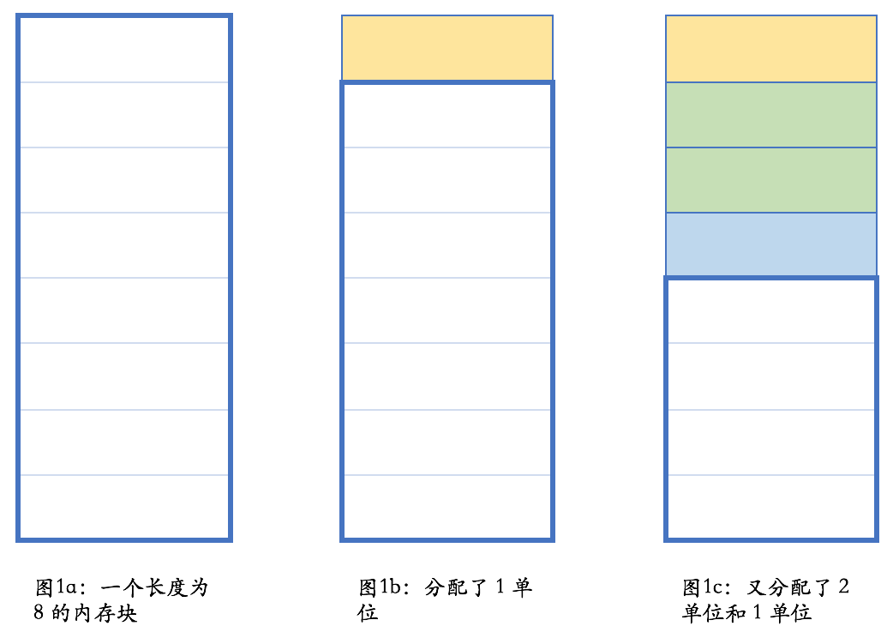
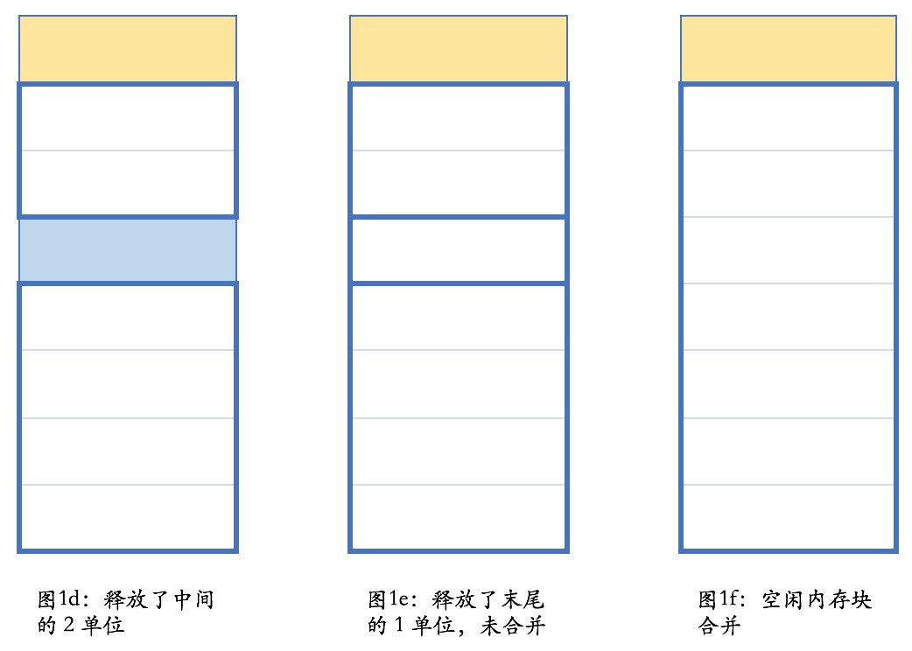
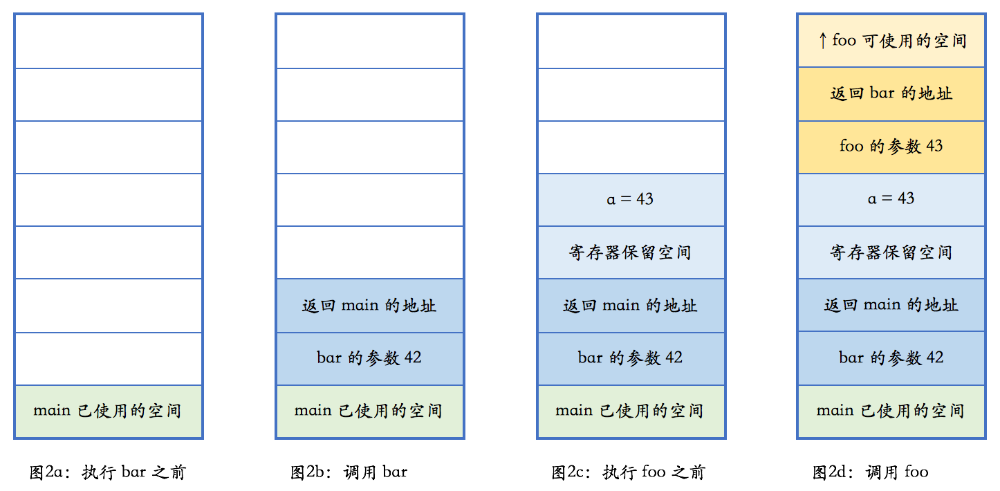

# 01 | 堆、栈、RAII：C++里该如何管理资源

内存管理的基本概念：

- 栈
- 堆
- RAII

## 1 基本概念

### 堆（heap）

堆是动态分配内存的区域，被分配之后需要手工释放，否则，就会造成内存泄漏。

自由存储区与堆：

- 自由存储区(free store)：特指使用 new 和 delete 来分配和释放内存的区域。
- 堆：malloc 和 free 操作的区域是 heap，但 new 和 delete 底层通常也是通过 malloc 来实现的，所以认为自由存储区是堆的一个子集。

### 栈（stack）

栈指的是函数调用过程中产生的本地变量和调用数据的区域。在函数或者块指向结束后，栈空间的内存自动释放，栈遵循后进先出的原则。

### RAII（Resource Acquisition Is Initialization）

RAII 是 C++ 所特有的资源管理方式，但主流的编程语言中， C++ 是唯一一个依赖 RAII 来做资源管理的。

- RAII 依托栈和析构函数，来对所有的资源——包括堆内存在内——进行管理。
- 对 RAII 的使用，使得 C++ 不需要类似于 Java 那样的垃圾收集方法，也能有效地对内存进行管理。
- RAII 的存在，也是垃圾收集虽然理论上可以在 C++ 使用，但从来没有真正流行过的主要原因。

## 2 堆

下面代码都会导致在堆上分配内存

```c
// C++
auto ptr = new std::vector<int>();

// Java
ArrayList list = new ArrayList();

// Python
list = list()
```

不同的语言在堆上分配内存不一致，但是不管哪种情况，程序通常需要牵涉到三个可能的内存管理器的操作：

1. 让内存管理器分配一个某个大小的内存块（Java、C++、Python）
2. 让内存管理器释放一个之前分配的内存块（C++、Python）
3. 让内存管理器进行垃圾收集操作，寻找不再使用的内存块并予以释放（Java、Python）

上面的三个操作都不简单，并且彼此之间是相关的：

- 分配内存要考虑程序当前已经有多少未分配的内存。内存不足时要从操作系统申请新的内存。内存充足时，要从可用的内存里取出一块合适大小的内存，做簿记工作将其标记为已用，然后将其返回给要求内存的代码。
- 绝大部分情况下，可用内存都会比要求分配的内存大，所以代码只被允许使用其被分配的内存区域，而剩余的内存区域仍属于未分配状态。后续需要更多内存时需要再次申请。
- 如果内存管理器支持垃圾收集的话，分配内存的操作还可能会触发垃圾收集。
- 释放内存不只是简单地把内存标记为未使用。对于连续未使用的内存块，通常内存管理器需要将其合并成一块，以便可以满足后续的较大内存分配要求。因为目前的编程模式都要求申请的内存块是连续的。
- 垃圾收集操作有很多不同的策略和实现方式，以实现性能、实时性、额外开销等各方面的平衡。

### 内存分配过程分析





1. 1e 的状态下，内存管理器是满足不了长度大于 4 的内存分配要求。此时内存空虚空间虽然时连续的，但是并没有合成一块。
2. 1f 的状态，长度小于等于 7 的单个内存要求都可以得到满足。
3. 1d 的情况下，虽然总共剩余内存为 6，但却满足不了长度大于 4 的内存分配要求。因为此时的内存有碎片化的情况，而程序要求申请的内存块是连续的。

上面碎片整理过程是不需要程序员参与的，这是内存管理器的任务，我们只需要正确地使用 new 和 delete。每个 new 出来的对象都应该用 delete 来释放即可。

### 正确地使用 new 和 delete

```cpp
void foo(){
  bar* ptr = new bar();
  …
  delete ptr;
}
```

上面代码片段存在以下问题：

1. 中间省略的代码部分也许会抛出异常，导致最后的 delete ptr 得不到执行。
2. 不符合 C++ 的惯用法。在 C++ 里，这种情况下有 99% 的可能性不应该使用堆内存分配，而应使用栈内存分配。

更常见、也更合理的情况，是分配和释放不在一个函数里，比如下面代码片段，会漏掉 delete 的可能性大多了：

```cpp
bar* make_bar(…){
  bar* ptr = nullptr;
  try {
    ptr = new bar();
    …
  }
  catch (...) {
    delete ptr;
    throw;
  }
  return ptr;
}

void foo(){
  …
  bar* ptr = make_bar(…)
  …
  delete ptr;
}
```

所以，正确地使用 new 和 delete 并没有那么简单。

## 3 栈

C++ 里函数调用、本地变量是如何使用栈的？

```cpp
void foo(int n){
  …
}

void bar(int n){
  int a = n + 1;
  foo(a);
}

int main(){
  …
  bar(42);
  …
}
```

这段代码执行过程中的栈变化如下图所示:



1. 栈是向上增长的。在包括 x86 在内的大部分计算机体系架构中，栈的增长方向是低地址，因而上方意味着低地址。
2. 任何一个函数，根据架构的约定，只能使用进入函数时栈指针向上部分的栈空间。
3. 当函数调用另外一个函数时，会把参数也压入栈里（我们此处忽略使用寄存器传递参数的情况），然后把下一行汇编指令的地址压入栈，并跳转到新的函数。
4. 新的函数进入后，首先做一些必须的保存工作，然后会调整栈指针，分配出本地变量所需的空间，随后执行函数中的代码，并在执行完毕之后，根据调用者压入栈的地址，返回到调用者未执行的代码中继续执行。

栈的特点是：**本地变量所需的内存就在栈上，跟函数执行所需的其他数据在一起。当函数执行完成之后，这些内存也就自然而然释放掉了**。

- 栈上的分配极为简单，移动一下栈指针而已。
- 栈上的释放也极为简单，函数执行结束时移动一下栈指针即可。
- 由于后进先出的执行过程，不可能出现内存碎片。

### 栈帧

图 2 中每种颜色都表示某个函数占用的栈空间。这部分空间有个特定的术语，叫做栈帧（stack frame）。GCC 和 Clang 的命令行参数中提到 frame 的，如 `-fomit-frame-pointer`，一般就是指栈帧。

### 栈展开

上述例子本地变量是简单类型，C++ 里称之为 POD 类型（Plain Old Data）。对于有构造和析构函数的非 POD 类型，栈上的内存分配也同样有效，只不过 C++ 编译器会在生成代码的合适位置，**插入对构造和析构函数的调用**。

编译器会自动调用析构函数，包括在函数执行发生异常的情况。在发生异常时对析构函数的调用，还有一个专门的术语，叫栈展开（stack unwinding），不管是否发生了异常，obj 的析构函数都会得到执行。

>如果你用 MSVC 编译含异常的 C++ 代码，但没有使用上一讲说过的 /EHsc 参数，编译器就会报告：`warning C4530: C++ exception handler used, but unwind semantics are not enabled. Specify /EHsc`。

栈展开示例：

```cpp
#include <stdio.h>

class Obj {
public:
  Obj() { puts("Obj()"); }
  ~Obj() { puts("~Obj()"); }
};

void foo(int n)
{
  Obj obj;
  if (n == 42)
    throw "life, the universe and everything";
}

int main()
{
  try {
    foo(41);
    foo(42);
  }
  catch (const char* s) {
    puts(s);
  }
}
```

执行输出：

```cpp
Obj()
~Obj()
Obj()
~Obj()
life, the universe and everything
```

### 与其他语言的区别

- **对象默认在栈上分配**：在 C++ 里，所有的变量缺省都是值语义——如果不使用 `*` 和 `&` 的话，变量不会像 Java 或 Python 一样引用一个堆上的对象。
- 对于像智能指针这样的类型，`ptr->call()` 和 `ptr.get()`，语法上都是对的，并且 `->` 和 `.` 有着不同的语法作用。而在大部分其他语言里，访问成员只用 `.`，但在作用上实际等价于 C++ 的 `->`。这种值语义和引用语义的区别，是 C++ 的特点，也是它的复杂性的一个来源。**要用好 C++，就需要理解它的值语义的特点**。

## 4 RAII

### RAII 简介

以下摘自[维基百科——RAII](https://zh.wikipedia.org/wiki/RAII)

RAII全称为 Resource Acquisition Is Initialization，它是在一些面向对象语言中的一种惯用法。RAII源于C++，在Java，C#，D，Ada，Vala和Rust中也有应用。1984-1989年期间，比雅尼·斯特劳斯特鲁普和安德鲁·柯尼希在设计 C++ 异常时，为解决资源管理时的异常安全性而使用了该用法，后来比雅尼·斯特劳斯特鲁普将其称为 RAII。**RAII 要求，资源的有效期与持有资源的对象的生命期严格绑定，即由对象的构造函数完成资源的分配（获取），同时由析构函数完成资源的释放。在这种要求下，只要对象能正确地析构，就不会出现资源泄露问题**。

RAII 的主要作用是在不失代码简洁性的同时，可以很好地保证代码的异常安全性。C++ 保证了所有栈对象在生命周期结束时会被销毁(即调用析构函数)，基于此，当一个函数需要通过多个局部变量来管理资源时，RAII 就显得非常好用。因为只有被构造成功(构造函数没有抛出异常)的对象才会在返回时调用析构函数，同时析构函数的调用顺序恰好是它们构造顺序的反序，这样既可以保证多个资源(对象)的正确释放，又能满足多个资源之间的依赖关系。

### 对象切片（object slicing）

C++ 支持将对象存储在栈上面。但是，在很多情况下，对象不能，或不应该，存储在栈上。比如：

- 对象很大。
- 对象的大小在编译时不能确定。
- 对象是函数的返回值，但由于特殊的原因，不应使用对象的值返回。

常见情况之一是，在工厂方法或其他面向对象编程的情况下，返回值类型是基类：

```cpp
enum class shape_type {
  circle,
  triangle,
  rectangle,
  …
};

class shape { … };
class circle : public shape { … };
class triangle : public shape { … };
class rectangle : public shape { … };

shape* create_shape(shape_type type)
{
  …
  switch (type) {
  case shape_type::circle:
    return new circle(…);
  case shape_type::triangle:
    return new triangle(…);
  case shape_type::rectangle:
    return new rectangle(…);
  …
  }
}
```

这种情况下，函数的返回值只能是指针或其变体形式。如果返回类型是 shape，实际却返回一个 circle，编译器不会报错，但结果多半是错的。这种现象叫**对象切片（object slicing）**，是 C++ 特有的一种编码错误。这种错误不是语法错误，而是一个对象复制相关的语义错误，也算是 C++ 的一个陷阱。

### 避免内存泄漏

怎样才能确保，在使用 create_shape 的返回值时不会发生内存泄漏？答案就在析构函数和它的栈展开行为上。我们只需要把这个返回值放到一个本地变量里，并确保其析构函数会删除该对象即可。

```cpp
class shape_wrapper {
public:
  //构造一个 shape_wrapper，传入 shape 类型的指针。
  explicit shape_wrapper(shape* ptr = nullptr) : ptr_(ptr) {

  }

    //在析构中释放对象
  ~shape_wrapper() {
    delete ptr_;
  }

  shape* get() const {
      return ptr_;
  }

private:
  shape* ptr_;

};

void foo(){
  …
  //在使用 create_shape 方法时，使用 shape_wrapper 包装一下，而 shape_wrapper 的析构是由编译器保证调用的，从而避免了内存泄漏。
  shape_wrapper ptr_wrapper(
    create_shape(…));
  …
}
```

在析构函数里做必要的清理工作，这就是 RAII 的基本用法。这种清理并不限于释放内存，也可以是：

- 关闭文件（fstream 的析构就会这么做）
- 释放同步锁
- 释放其他重要的系统资源

比如下面对锁资源的管理：

```cpp
//正确的方式
std::mutex mtx;

void some_func()
{
  std::lock_guard<std::mutex> guard(mtx);
  //  做需要同步的工作
}

//不好的方式
std::mutex mtx;

void some_func()
{
  mtx.lock();
  //  做需要同步的工作……
  //  如果发生异常或提前返回，
  //  下面这句不会自动执行。
  mtx.unlock();
}
```

这里的 shape_wrapper 差不多就是个最简单的智能指针了。

### delete 空指针会发生什么

上面 shape_wrapper 构造函数如果传入空指针会导致 delete 的是空指针。但是 **delete 一个空指针是一个合法的空操作**。在 new 一个对象和 delete 一个指针时编译器需要干不少活的，它们大致可以如下翻译：

```cpp
// new circle(…)
{
  void* temp = operator new(sizeof(circle));
  try {
    circle* ptr = static_cast<circle*>(temp);
    ptr->circle(…);
    return ptr;
  }
  catch (...) {
    operator delete(ptr);
    throw;
  }
}

if (ptr != nullptr) {
  ptr->~shape();
  operator delete(ptr);
}
```

- new 的时候先分配内存（失败时整个操作失败并向外抛出异常，通常是 bad_alloc），然后在这个结果指针上构造对象（注意上面示意中的调用构造函数并不是合法的 C++ 代码）。
- 构造成功则 new 操作整体完成，否则释放刚分配的内存并继续向外抛构造函数产生的异常。
- delete 时则判断指针是否为空，在指针不为空时调用析构函数并释放之前分配的内存。

## 原文地址

- [01 | 堆、栈、RAII：C++里该如何管理资源？](https://time.geekbang.org/column/article/169225)
