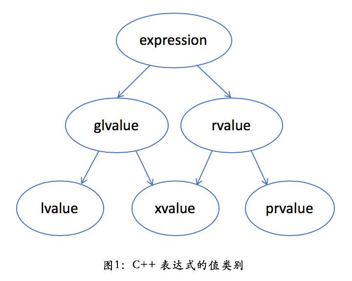
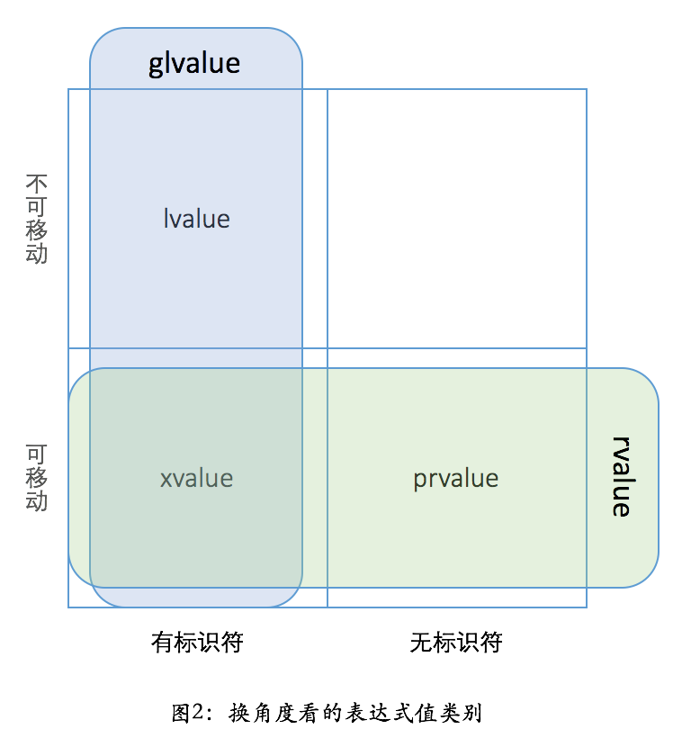

# 03 | 右值和移动究竟解决了什么问题？

---
## 1 左值与右值

### 1.1 C++ 的值类别

C++ 里有左值和右值。划分地更细一下，C++ 标准规定了下面这些值类别（value categories）



- 一个 lvalue 是通常可以放在等号左边的表达式，左值
- 一个 rvalue 是通常只能放在等号右边的表达式，右值
- 一个 glvalue 是 generalized lvalue，广义左值
- 一个 xvalue 是 expiring lvalue，将亡值
- 一个 prvalue 是 pure rvalue，纯右值

### 1.2 lvalue

左值 lvalue 是有标识符、可以取地址的表达式，最常见的情况有：

- 变量、函数或数据成员的名字
- 返回左值引用的表达式，如 `++x、x = 1、cout << ' '`
- 字符串字面量如 `"hello world"`

在函数调用时，左值可以绑定到左值引用的参数，如 T&。一个常量只能绑定到常左值引用，如 const T&。

```cpp
string& s = "hello world";
```

### 1.3 prvalue

纯右值 prvalue 是没有标识符、不可以取地址的表达式，一般也称之为“临时对象”。最常见的情况有：

- 返回非引用类型的表达式，如 `x++、x + 1、make_shared<int>(42)`
- 除字符串字面量之外的字面量，如 42、true

### 1.4 右值引用

在 C++11 之前，右值可以绑定到常左值引用（const lvalue reference）的参数，如 const T&，但不可以绑定到非常左值引用（non-const lvalue reference），如 T&。

```cpp
int i = 42;
int &r = i;
//int &r2 = i * 24; 错误
const int &r3 = i * 24;
```

C++11 开始，C++ 语言里多了一种引用类型——右值引用。右值引用的形式是 T&&，比左值引用多一个 & 符号。

>跟左值引用一样，我们可以使用 const 和 volatile 来进行修饰，但一般我们不会用 const 和 volatile 来修饰右值。

```cpp
int i = 42;
int &r = i;
//int &&rr = i; 错误
//int &r2 = i * 24; 错误
const int &r3 = i * 24;
int &&rr2 = i * 24;
```

#### 右值引用与优化

引入一种额外的引用类型当然增加了语言的复杂性，但也带来了很多优化的可能性。由于 C++ 有重载，我们就可以根据不同的引用类型，来选择不同的重载函数，来完成不同的行为。

比如在[实现C++智能指针中](02-实现C++的智能指针.md)利用了重载，让 smart_ptr 的构造函数可以有不同的行为：

```cpp

template <typename U>
smart_ptr(const smart_ptr<U>& other) noexcept {
  ptr_ = other.ptr_;
  if (ptr_) {
    other.shared_count_->add_count();
    shared_count_ = other.shared_count_;
  }
}

template <typename U>
smart_ptr(smart_ptr<U>&& other) noexcept {
  ptr_ = other.ptr_;
  if (ptr_) {
    shared_count_ = other.shared_count_;
    other.ptr_ = nullptr;
  }
}
```

#### 类型是右值引用的变量是一个左值

- 使用右值引用的第二个重载函数中的变量 `smart_ptr<U>&& other` 算是左值还是右值？根据定义，other 是个变量的名字，变量有标识符、有地址，所以它还是一个左值——虽然它的类型是右值引用。
- 拿这个 other 去调用函数时，它匹配的也会是左值引用。

### 1.5 xvalue 和 prvalue

对于下面代码

```cpp
smart_ptr<shape> ptr1{new circle()};
smart_ptr<shape> ptr2 = std::move(ptr1);
```

- 第一个表达式里的 `new circle()` 就是一个纯右值；但对于指针，我们通常使用值传递，并不关心它是左值还是右值。
- 第二个表达式里的 `std::move(ptr)` 。它的作用是把一个左值引用强制转换成一个右值引用，而并不改变其内容。从实用的角度，在这儿 `std::move(ptr1)` 等价于 `static_cast&&>(ptr1)`。因此，`std::move(ptr1)` 的结果是指向 ptr1 的一个右值引用，这样构造 ptr2 时就会选择上面第二个重载。

xvalue：

- 我们可以把 `std::move(ptr1)` 看作是一个有名字的右值。为了跟无名的纯右值 prvalue 相区别，C++ 里目前就把这种表达式叫做 xvalue。
- 跟左值 lvalue 不同，xvalue 仍然是不能取地址的——这点上，xvalue 和 prvalue 相同。所以，xvalue 和 prvalue 都被归为右值 rvalue。



### 1.6 “值类别”（value category）和“值类型”

“值类别”（value category）和“值类型”（value type）是两个看似相似、却毫不相干的术语。

- 值类别指的是上面这些左值、右值相关的概念，
- 值类型是与引用类型（reference type）相对而言，表明一个变量是代表实际数值，还是引用另外一个数值。在 C++ 里，所有的原生类型、枚举、结构、联合、类都代表值类型，只有引用（&）和指针（*）才是引用类型。在 Java 里，数字等原生类型是值类型，类则属于引用类型。在 Python 里，一切类型都是引用类型。

---
## 2 生命周期和表达式类型

- **一般对象的生命周期**：一个变量的生命周期在超出作用域时结束。如果一个变量代表一个对象，当然这个对象的生命周期也在那时结束。
- **临时对象（prvalue）的生命周期**：C++ 规定一个临时对象会在包含这个临时对象的完整表达式估值完成后、按生成顺序的逆序被销毁，除非有生命周期延长发生。

参考下面代码：

```cpp
class shape {
public:
    virtual ~shape() {}
};

class circle : public shape {
public:
    circle() { puts("circle()"); }

    ~circle() { puts("~circle()"); }
};

class triangle : public shape {
public:
    triangle() { puts("triangle()"); }

    ~triangle() { puts("~triangle()"); }
};

class result {
public:
    result() { puts("result()"); }

    ~result() { puts("~result()"); }
};

result
process_shape(const shape &shape1,
              const shape &shape2) {
    puts("process_shape()");
    return result();
}

int main() {
    puts("main()");
    process_shape(circle(), triangle());
    puts("something else");

    return EXIT_SUCCESS;
}
```

演示一个没有生命周期延长的基本情况，可以看到结果的临时对象最后生成、最先析构。

```cpp
process_shape(circle(), triangle());

//输出
main()
triangle()
circle()
process_shape()
result()
~result()
~result()
~circle()
~triangle()
something else
```

如果一个 prvalue 被绑定到一个引用上，它的生命周期则会延长到跟这个引用变量一样长。

```cpp
result&& r = process_shape( circle(), triangle());

//输出
main()
triangle()
circle()
process_shape()
result()
~result()
~circle()
~triangle()
something else
~result()
```

现在 result 的生成还在原来的位置，但析构被延到了 main 的最后。

**声明延长只对 prvalue 有效**：需要万分注意的是，这条生命期延长规则只对 prvalue 有效，而对 xvalue 无效。如果由于某种原因，prvalue 在绑定到引用以前已经变成了 xvalue，那生命期就不会延长。不注意这点的话，代码就可能会产生隐秘的 bug。比如，我们如果这样改一下代码，结果就不对了：

```cpp
result&& r = std::move(process_shape( circle(), triangle()));
```

这时的代码输出就回到了前一种情况。虽然执行到 something else 那儿我们仍然有一个有效的变量 r，但它指向的对象已经不存在了，对 r 的解引用是一个未定义行为。由于 r 指向的是栈空间，通常不会立即导致程序崩溃，而会在某些复杂的组合条件下才会引致问题……

另外，参考[Herb Sutter, “GotW #88: A candidate for the ‘most important const’”.](https://herbsutter.com/2008/01/01/gotw-88-a-candidate-for-the-most-important-const/)中提到的，可以把一个没有虚析构函数的子类对象绑定到基类的引用变量上，这个子类对象的析构仍然是完全正常的——这是因为这条规则只是延后了临时对象的析构而已，不是利用引用计数等复杂的方法，因而只要引用绑定成功，其类型并没有什么影响。

---
## 3 移动的意义

### 3.1 减少运行时开销

对于 smart_ptr，我们使用右值引用的目的是实现移动，而实现移动的意义是减少运行的开销。

#### 针对指针的情况

在引用计数指针的场景下，这个开销并不大。移动构造和拷贝构造的差异仅在于：

- 少了一次 `other.shared_count_->add_count()` 的调用
- 被移动的指针被清空，因而析构时也少了一次 shared_count_->reduce_count() 的调用

#### 使用容器类的情况

分析下面代码：

```cpp
//假设name是string类型
string result = string("Hello, ") + name + ".";
```

在 C++11 之前的年代里，这种写法是绝对不推荐的。因为它会引入很多额外开销，执行流程大致如下：

1. 调用构造函数 `string(const char*)`，生成临时对象 1；"Hello, " 复制 1 次。
2. 调用 `operator+(const string&, const string&)`，生成临时对象 2；"Hello, " 复制 2 次，name 复制 1 次。
3. 调用 `operator+(const string&, const char*)`，生成对象 3；"Hello, " 复制 3 次，name 复制 2 次，"." 复制 1 次。
4. 假设返回值优化能够生效（最佳情况），对象 3 可以直接在 result 里构造完成。
5. 临时对象 2 析构，释放指向 string("Hello, ") + name 的内存。
6. 临时对象 1 析构，释放指向 string("Hello, ") 的内存。

既然 C++ 是一门追求性能的语言，一个合格的 C++ 程序员会写

```cpp
string result = "Hello, ";
result += name;
result += ".";
```

这样的话，只会调用构造函数一次和 `string::operator+=` 两次，没有任何临时对象需要生成和析构，所有的字符串都只复制了一次。但显然代码就啰嗦多了——尤其如果拼接的步骤比较多的话。从 C++11 开始，这不再是必须的。同样上面那个单行的语句，执行流程大致如下：

1. 调用构造函数 `string(const char*)`，生成临时对象 1；"Hello, " 复制 1 次。
2. 调用 `operator+(string&&, const string&)`，直接在临时对象 1 上面执行追加操作，并把结果移动到临时对象 2；name 复制 1 次。
3. 调用 `operator+(string&&, const char*)`，直接在临时对象 2 上面执行追加操作，并把结果移动到 result；"." 复制 1 次。
4. 临时对象 2 析构，内容已经为空，不需要释放任何内存。
5. 临时对象 1 析构，内容已经为空，不需要释放任何内存。

性能上，所有的字符串只复制了一次；虽然比啰嗦的写法仍然要增加临时对象的构造和析构，但由于这些操作不牵涉到额外的内存分配和释放，是相当廉价的。程序员只需要牺牲一点点性能，就可以大大增加代码的可读性。而且，所谓的性能牺牲，也只是相对于优化得很好的 C 或 C++ 代码而言——这样的 C++ 代码的性能仍然完全可以超越 Python 类的语言的相应代码。

### 3.2 C++ 里的对象缺省都是值语义

参考下面代码：

```cpp
class A {
  B b_;
  C c_;
};
```

从实际内存布局的角度，很多语言如 Java 和 Python 会在 A 对象里放 B 和 C 的指针（虽然这些语言里本身没有指针的概念）。而 C++ 则会直接把 B 和 C 对象放在 A 的内存空间里。这种行为既是优点也是缺点。

- 优点：因为它保证了内存访问的局域性，而局域性在现代处理器架构上是绝对具有性能优势的。
- 缺点：因为复制对象的开销大大增加：在 Java 类语言里复制的是指针，在 C++ 里是完整的对象。这就是为什么 C++ 需要移动语义这一优化，而 Java 类语言里则根本不需要这个概念。

一句话总结，移动语义使得在 C++ 里返回大对象（如容器）的函数和运算符成为现实，因而可以提高代码的简洁性和可读性，提高程序员的生产率。**所有的现代 C++ 的标准容器都针对移动进行了优化**。

---
## 4 如何实现移动？

让你设计的对象支持移动的话，通常需要下面几步：

- 你的对象应该有分开的拷贝构造和移动构造函数（除非你只打算支持移动，不支持拷贝——如 unique_ptr）。
- 你的对象应该有 swap 成员函数，支持和另外一个对象快速交换成员。
- 在你的对象的名空间下，应当有一个全局的 swap 函数，调用成员函数 swap 来实现交换。支持这种用法会方便别人（包括你自己在将来）在其他对象里包含你的对象，并快速实现它们的 swap 函数。
- 实现通用的 operator=。上面各个函数如果不抛异常的话，应当标为 noexcept。这对移动构造函数尤为重要。

### 4.1 以 smart_ptr 实现为例

smart_ptr 有拷贝构造和移动构造函数（虽然此处我们的模板构造函数严格来说不算拷贝或移动构造函数）。移动构造函数应当从另一个对象获取资源，清空其资源，并将其置为一个可析构的状态。

```cpp
//为什么要加上 noexcept，参考《C++ Primer 5E》13.6.2 移动操作与标准容器库和异常
smart_ptr(const smart_ptr& other) noexcept{
  ptr_ = other.ptr_;
  if (ptr_) {
    other.shared_count_ ->add_count();
    shared_count_ = other.shared_count_;
  }
}

template <typename U>
smart_ptr(const smart_ptr<U>& other) noexcept {
  ptr_ = other.ptr_;
  if (ptr_) {
    other.shared_count_ ->add_count();
    shared_count_ = other.shared_count_;
  }
}

template <typename U>
smart_ptr(smart_ptr<U>&& other) noexcept{
  ptr_ = other.ptr_;
  if (ptr_) {
    shared_count_ = other.shared_count_;
    other.ptr_ = nullptr;
  }
}
```

smart_ptr 有 swap 成员函数。

```cpp
void swap(smart_ptr& rhs) noexcept{
  using std::swap;
  swap(ptr_, rhs.ptr_);
  swap(shared_count_, rhs.shared_count_);
}
```

有支持 smart_ptr 的全局 swap 函数。

```cpp
template <typename T>
void swap(smart_ptr<T>& lhs, smart_ptr<T>& rhs) noexcept{
  lhs.swap(rhs);
}
```

smart_ptr 有通用的 operator= 成员函数。注意为了避免让人吃惊，通常我们需要将其实现成对 a = a; 这样的写法安全。下面的写法算是个小技巧，对传递左值和右值都有效，而且规避了 if (&rhs != this) 这样的判断。

```cpp
smart_ptr&
operator=(smart_ptr rhs) noexcept {
    rhs.swap(*this);
    return *this;
}
```

---
## 5 不要返回本地变量的引用

有一种常见的 C++ 编程错误，是**在函数里返回一个本地对象的引用**。由于在函数结束时本地对象即被销毁，返回一个指向本地对象的引用属于未定义行为。理论上来说，程序出任何奇怪的行为都是正常的。

- 在 C++11 之前，返回一个本地对象意味着这个对象会被拷贝，除非编译器发现可以做返回值优化（named return value optimization，或 NRVO），能把对象直接构造到调用者的栈上。
- 从 C++11 开始，返回值优化仍可以发生，但在没有返回值优化的情况下，编译器将试图把本地对象移动出去，而不是拷贝出去。这一行为不需要程序员手工用 `std::move` 进行干预——使用 `std::move` 对于移动行为没有帮助，反而会影响返回值优化。

具体参考下面代码：

```cpp
#include <iostream>  // std::cout/endl
#include <utility>   // std::move

using namespace std;

class Obj {
public:
  Obj(){
    cout << "Obj()" << endl;
  }

  Obj(const Obj&){
    cout << "Obj(const Obj&)"
       << endl;
  }

  Obj(Obj&&){
    cout << "Obj(Obj&&)" << endl;
  }
};

Obj simple(){
  Obj obj;
  //  简单返回对象；一般有  NRVO
  return obj;
}

Obj simple_with_move(){
  Obj obj;
  // move  会禁止  NRVO
  return std::move(obj);
}

Obj complicated(int n){
  Obj obj1;
  Obj obj2;
  //  有分支，一般无  NRVO
  if (n % 2 == 0) {
    return obj1;
  } else {
    return obj2;
  }
}

int main(){
  cout << "*** 1 ***" << endl;
  auto obj1 = simple();
  cout << "*** 2 ***" << endl;
  auto obj2 = simple_with_move();
  cout << "*** 3 ***" << endl;
  auto obj3 = complicated(42);
}
```

输出结果

```cpp
*** 1 ***
Obj()
*** 2 ***
Obj()
Obj(Obj&&)
*** 3 ***
Obj()
Obj()
Obj(Obj&&)
```

---
## 6 引用坍缩和完美转发

引用坍缩（又称“引用折叠”）。这个概念在泛型编程中是一定会碰到的。既然讲了左值和右值引用，也需要一起讲一下。

对于一个实际的类型 T，它的左值引用是 T&，右值引用是 T&&。那么：

1. 是不是看到 T&，就一定是个左值引用？
2. 是不是看到 T&&，就一定是个右值引用？

对于前者的回答是“是”，对于后者的回答为“否”。关键在于，在有模板的代码里，对于类型参数的推导结果可能是引用。我们可以略过一些繁复的语法规则，要点是：对于 `template<typename T> foo(T&&)` 这样的代码，

- 如果传递过去的参数是左值，T 的推导结果是左值引用。
- 如果传递过去的参数是右值，T 的推导结果是参数的类型本身。
- 如果 T 是左值引用，那 T&& 的结果仍然是左值引用——即 type&& 坍缩成了 type&。
- 如果 T 是一个实际类型，那 T&& 的结果自然就是一个右值引用。

上面提到：右值引用变量仍然会匹配到左值引用上去。下面的代码会验证这一行为：

```cpp
void foo(const shape&){
  puts("foo(const shape&)");
}

void foo(shape&&){
  puts("foo(shape&&)");
}

void bar(const shape& s){
  puts("bar(const shape&)");
  foo(s);
}

void bar(shape&& s){
  puts("bar(shape&&)");
  foo(s);
}

int main(){
  bar(circle());
}
```

输出为：

```cpp
bar(shape&&)
foo(const shape&)
```

如果我们要让 bar 调用右值引用的那个 foo 的重载，我们必须写成：

```cpp
foo(std::move(s));
foo(static_cast(s));
```

可如果两个 bar 的重载除了调用 foo 的方式不一样，其他都差不多的话，我们为什么要提供两个不同的 bar 呢？

事实上，很多标准库里的函数，连目标的参数类型都不知道，但我们仍然需要能够保持参数的值类别：左值的仍然是左值，右值的仍然是右值。这个功能在 C++ 标准库中已经提供了，叫 `std::forward`。它和 `std::move` 一样都是利用引用坍缩机制来实现。此处，我们不介绍其实现细节，而是重点展示其用法。我们可以把我们的两个 bar 函数简化成：

```cpp
template <typename T>
void bar(T&& s) {
  foo(std::forward<T>(s));
}
```

对于下面这样的代码：

```cpp
circle temp;
bar(temp);
bar(circle());
```

输出是：

```cpp
foo(const shape&)
foo(shape&&)
```

一切如预期一样。因为在 T 是模板参数时，T&& 的作用主要是保持值类别进行转发，它有个名字就叫“转发引用”（forwarding reference）。因为既可以是左值引用，也可以是右值引用，它也曾经被叫做“万能引用”（universal reference）。

---
## 7 总结

内容归纳：

- C++ 里的值类别
- 临时变量
- 右值引用
- 移动语义
- 实际的编程用法
  - 实现移动
  - 不要返回本地变量引用
  - 引用坍塌与转发

其他：

- 字符串字面量是左值，在C++中 字符串其实是 `const char[N]`，其实是个常量表达式，在内存中有明确的地址。
- xvalue, 通常是使用std::move被强制转换为右值的值。
- 对于 `result&& r = std::move(process_shape( circle(), triangle()));` 这个 r 当然是个左值, 它指代的右值, 就是 xvalue。

---
## 8 思考题

1 请查看一下标准函数模板 `make_shared` 的声明，然后想一想，这个函数应该是怎样实现的。

2 为什么 `smart_ptr::operator=` 对左值和右值都有效，而且不需要对等号两边是否引用同一对象进行判断？

- 答：左值和右值都有效是因为构造参数时，如果是左值，就用拷贝构造构造函数，右值就用移动构造函数无论是左值还是右值，构造参数时直接生成新的智能指针，因此不需要判断。

---
## 9 原文

- [03 | 右值和移动究竟解决了什么问题？](https://time.geekbang.org/column/article/169268)
