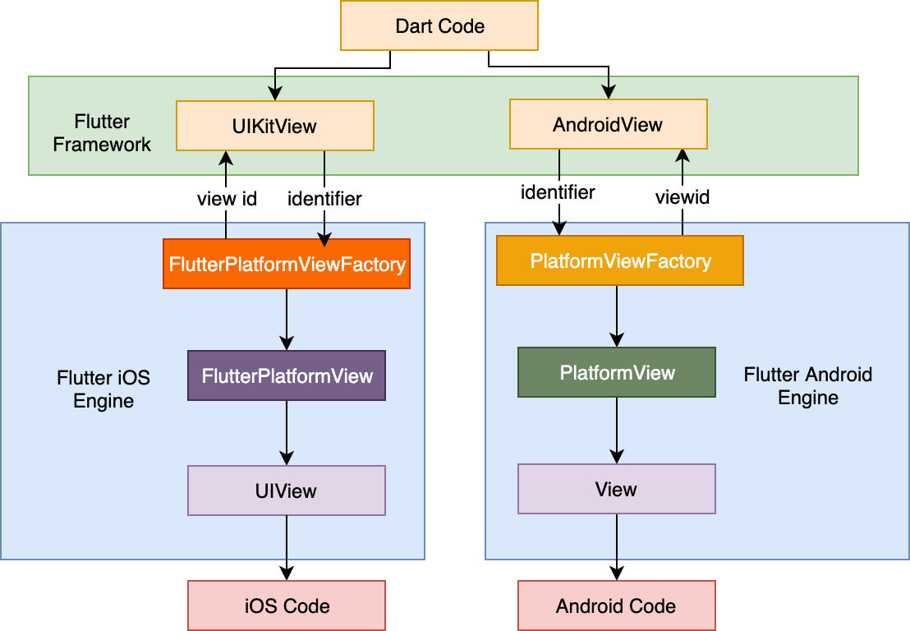

# 极客时间 [《Flutter核心技术与实战》](https://time.geekbang.org/column/article/104040)：在Dart层兼容Android与iOS平台特定实现2-平台视图

底层能力 + 应用层渲染，看似我们已经搞定了搭建一个复杂 App 的所有内容。但，真的是这样吗？

## 1 构建一个复杂 App 都需要什么

先按照四象限分析法，把能力和渲染分解成四个维度，分析构建一个复杂 App 都需要什么：


通过分析发现：

1. 通过 Flutter 和方法通道只能搞定应用层渲染、应用层能力和底层能力
2. 对于那些涉及到底层渲染，比如浏览器、相机、地图，以及原生自定义视图的场景，自己在 Flutter 上重新开发一套显然不太现实。

对于第二点，有两套方案:

1. **混合视图**：使用混合视图，我们可以在 Flutter 的 Widget 树中提前预留一块空白区域，在 Flutter 的画板中（即 FlutterView 与 FlutterViewController）嵌入一个与空白区域完全匹配的原生视图，就可以实现想要的视觉效果了。但是，采用这种方案极其不优雅，因为嵌入的原生视图并不在 Flutter 的渲染层级中，需要同时在 Flutter 侧与原生侧做大量的适配工作，才能实现正常的用户交互体验。
2. **平台视图（Platform View）**：它提供了一种方法，允许开发者在 Flutter 里面嵌入原生系统（Android 和 iOS）的视图，并加入到 Flutter 的渲染树中，实现与 Flutter 一致的交互体验。这样一来，通过平台视图，我们就可以将一个原生控件包装成 Flutter 控件，嵌入到 Flutter 页面中，就像使用一个普通的 Widget 一样。

## 1 平台视图

- 方法通道解决的是原生能力**逻辑复用问题**。
- 平台视图解决的就是**原生视图复用问题**。

Flutter 提供了一种轻量级的方法，让我们可以创建原生（Android 和 iOS）的视图，通过一些简单的 Dart 层接口封装之后，就可以将它插入 Widget 树中，实现原生视图与 Flutter 视图的混用。

一次典型的平台视图使用过程与方法通道类似：

1. 首先，由作为客户端的 Flutter，通过向原生视图的 Flutter 封装类（在 iOS 和 Android 平台分别是 UIKitView 和 AndroidView）传入视图标识符，用于发起原生视图的创建请求；
2. 然后，原生代码侧将对应原生视图的创建交给平台视图工厂（PlatformViewFactory）实现；
3. 最后，在原生代码侧将视图标识符与平台视图工厂进行关联注册，让 Flutter 发起的视图创建请求可以直接找到对应的视图创建工厂。



## 2 平台视图的使用

平台视图的使用涉及到两个问题：

1. 作为调用发起方的 Flutter，如何实现原生视图的接口调用？
2. 如何在原生（Android 和 iOS）系统实现接口？

下面以具体案例——将一个红色的原生视图内嵌到 Flutter 中。演示如何使用平台视图。

### 2.1 Flutter 如何实现原生视图的接口调用

在 SampleView 的内部，分别使用了原生 Android、iOS 视图的封装类 AndroidView 和 UIkitView，并传入了一个唯一标识符，用于和原生视图建立关联：

```dart
class SampleView extends StatelessWidget {

  @override
  Widget build(BuildContext context) {
    // 使用 Android 平台的 AndroidView，传入唯一标识符 sampleView
    if (defaultTargetPlatform == TargetPlatform.android) {
      return AndroidView(viewType: 'sampleView');
    } else {
      // 使用 iOS 平台的 UIKitView，传入唯一标识符 sampleView
      return UiKitView(viewType: 'sampleView');
    }
  }

}
```

平台视图在 Flutter 侧的使用方式比较简单，与普通 Widget 并无明显区别。

### 2.2 如何在原生系统实现接口

#### Android 平台实现

在下面的代码中，我们分别创建了平台视图工厂和原生视图封装类，并通过视图工厂的 create 方法，将它们关联起来：

```java
// 视图工厂类
class SampleViewFactory extends PlatformViewFactory {
    private final BinaryMessenger messenger;
    // 初始化方法
    public SampleViewFactory(BinaryMessenger msger) {
        super(StandardMessageCodec.INSTANCE);
        messenger = msger;
    }
    // 创建原生视图封装类，完成关联
    @Override
    public PlatformView create(Context context, int id, Object obj) {
        return new SimpleViewControl(context, id, messenger);
    }
}

// 原生视图封装类
class SimpleViewControl implements PlatformView {
    private final View view;// 缓存原生视图
    // 初始化方法，提前创建好视图
    public SimpleViewControl(Context context, int id, BinaryMessenger messenger) {
        view = new View(context);
        view.setBackgroundColor(Color.rgb(255, 0, 0));
    }

    // 返回原生视图
    @Override
    public View getView() {
        return view;
    }
    // 原生视图销毁回调
    @Override
    public void dispose() {
    }
}
```

将原生视图封装类与原生视图工厂完成关联后，接下来就需要将 Flutter 侧的调用与视图工厂绑定起来了。

```java
protected void onCreate(Bundle savedInstanceState) {
    ...
    Registrar registrar =  registrarFor("samples.chenhang/native_views");// 生成注册类
    SampleViewFactory playerViewFactory = new SampleViewFactory(registrar.messenger());// 生成视图工厂
    registrar.platformViewRegistry().registerViewFactory("sampleView", playerViewFactory);// 注册视图工厂
}
```

#### IOS 平台实现

与 Android 类似，我们同样需要分别创建平台视图工厂和原生视图封装类，并通过视图工厂的 create 方法，将它们关联起来：

```oc
// 平台视图工厂
@interface SampleViewFactory : NSObject<FlutterPlatformViewFactory>
- (instancetype)initWithMessenger:(NSObject<FlutterBinaryMessenger>*)messager;
@end
 
@implementation SampleViewFactory{
  NSObject<FlutterBinaryMessenger>*_messenger;
}
 
- (instancetype)initWithMessenger:(NSObject<FlutterBinaryMessenger> *)messager{
  self = [super init];
  if (self) {
    _messenger = messager;
  }
  return self;
}
 
-(NSObject<FlutterMessageCodec> *)createArgsCodec{
  return [FlutterStandardMessageCodec sharedInstance];
}
 
// 创建原生视图封装实例
-(NSObject<FlutterPlatformView> *)createWithFrame:(CGRect)frame viewIdentifier:(int64_t)viewId arguments:(id)args{
  SampleViewControl *activity = [[SampleViewControl alloc] initWithWithFrame:frame viewIdentifier:viewId arguments:args binaryMessenger:_messenger];
  return activity;
}
@end
 
// 平台视图封装类
@interface SampleViewControl : NSObject<FlutterPlatformView>
- (instancetype)initWithWithFrame:(CGRect)frame viewIdentifier:(int64_t)viewId arguments:(id _Nullable)args binaryMessenger:(NSObject<FlutterBinaryMessenger>*)messenger;
@end
 
@implementation SampleViewControl{
    UIView * _templcateView;
}
// 创建原生视图
- (instancetype)initWithWithFrame:(CGRect)frame viewIdentifier:(int64_t)viewId arguments:(id)args binaryMessenger:(NSObject<FlutterBinaryMessenger> *)messenger{
  if ([super init]) {
    _templcateView = [[UIView alloc] init];
    _templcateView.backgroundColor = [UIColor redColor];
  }
  return self;
}
 
-(UIView *)view{
  return _templcateView;
}
 
@end
```

然后，我们同样需要把原生视图的创建与 Flutter 侧的调用关联起来，才可以在 Flutter 侧找到原生视图的实现：

```oc
- (BOOL)application:(UIApplication *)application didFinishLaunchingWithOptions:(NSDictionary *)launchOptions {
  NSObject<FlutterPluginRegistrar>* registrar = [self registrarForPlugin:@"samples.chenhang/native_views"];// 生成注册类
  SampleViewFactory* viewFactory = [[SampleViewFactory alloc] initWithMessenger:registrar.messenger];// 生成视图工厂
    [registrar registerViewFactory:viewFactory withId:@"sampleView"];// 注册视图工厂
 ...
}
```

需要注意的是，在 iOS 平台上，Flutter 内嵌 UIKitView 目前还处于技术预览状态，因此我们还需要在 Info.plist 文件中增加一项配置，把内嵌原生视图的功能开关设置为 true，才能打开这个隐藏功能：

```xml
<dict>
   ...
  <key>io.flutter.embedded_views_preview</key>
  <true/>
  ....
</dict>
```

#### 完成平台视图集成

经过上面的封装与绑定，Android 端与 iOS 端的平台视图功能都已经实现了。接下来，我们就可以在 Flutter 应用里，像使用普通 Widget 一样，去内嵌原生视图了：

```dart
 Scaffold(
    backgroundColor: Colors.yellowAccent,
    body:  Container(width: 200, height:200,
        child: SampleView(controller: controller)
    ));
```

## 3 如何在程序运行时，动态地调整原生视图的样式

与基于声明式的 Flutter Widget，每次变化只能以数据驱动其视图销毁重建不同，原生视图是基于命令式的，可以精确地控制视图展示样式。因此，我们可以在原生视图的封装类中，将其持有的修改视图实例相关的接口，以方法通道的方式暴露给 Flutter，让 Flutter 也可以拥有动态调整视图视觉样式的能力。

示例：在程序运行时动态调整内嵌原生视图的背景颜色

### 3.1 Flutter 层实现视图集成与原生方法调用

注意：

- onPlatformViewCreated 方法说明：原生视图会在其创建完成后，以回调的形式通知视图 id，因此我们可以在这个时候注册方法通道，让后续的视图修改请求通过这条通道传递给原生视图。
- 原生试图调用方式：由于我们在底层直接持有了原生视图的实例，因此理论上可以直接在这个原生视图的 Flutter 封装类上提供视图修改方法，而不管它到底是 StatelessWidget 还是 StatefulWidget。但为了遵照 Flutter 的 Widget 设计理念，我们还是决定将视图展示与视图控制分离，即：将原生视图封装为一个 StatefulWidget 专门用于展示，通过其 controller 初始化参数，在运行期修改原生视图的展示效果。

```dart
// 原生视图控制器
class NativeViewController {

  MethodChannel _channel;

  // 原生视图完成创建后，通过 id 生成唯一方法通道
  onCreate(int id) {
    _channel = MethodChannel('samples.chenhang/native_views_$id');
  }

  // 调用原生视图方法，改变背景颜色
  Future<void> changeBackgroundColor() async {
    return _channel.invokeMethod('changeBackgroundColor');
  }

}

// 原生视图 Flutter 侧封装，继承自 StatefulWidget
class SampleView extends StatefulWidget {

  const SampleView({
    Key key,
    this.controller,
  }) : super(key: key);

  // 持有视图控制器
  final NativeViewController controller;

  @override
  State<StatefulWidget> createState() => _SampleViewState();
}

class _SampleViewState extends State<SampleView> {

  // 根据平台确定返回何种平台视图
  @override
  Widget build(BuildContext context) {
    if (defaultTargetPlatform == TargetPlatform.android) {
      return AndroidView(
        viewType: 'sampleView',
        // 原生视图创建完成后，通过 onPlatformViewCreated 产生回调
        onPlatformViewCreated: _onPlatformViewCreated,
      );
    } else {
      return UiKitView(viewType: 'sampleView',
        // 原生视图创建完成后，通过 onPlatformViewCreated 产生回调
        onPlatformViewCreated: _onPlatformViewCreated
      );
    }
  }

  // 原生视图创建完成后，调用 control 的 onCreate 方法，传入 view id
  _onPlatformViewCreated(int id) {
    if (widget.controller == null) {
      return;
    }
    widget.controller.onCreate(id);
  }
}
```

### 3.2 原生平台实现

Flutter 层方法调用完成了，接下来就是具体平台的实现了：程序的整体结构与之前并无不同，只是在进行原生视图初始化时，我们需要完成方法通道的注册和相关事件的处理；在响应方法调用消息时，我们需要判断方法名，如果完全匹配，则修改视图背景，否则返回异常。

Android 端接口实现代码如下所示：

```java
class SimpleViewControl implements PlatformView, MethodCallHandler {

    private final MethodChannel methodChannel;
    private final View view;

    public SimpleViewControl(Context context, int id, BinaryMessenger messenger) {
        //初始化 View
        view = new View(context);
        view.setBackgroundColor(Color.rgb(255, 0, 0));
        // 用 view id 注册方法通道
        methodChannel = new MethodChannel(messenger, "samples.chenhang/native_views_" + id);
        // 设置方法通道回调
        methodChannel.setMethodCallHandler(this);
    }

    // 处理方法调用消息
    @Override
    public void onMethodCall(MethodCall methodCall, MethodChannel.Result result) {
        // 如果方法名完全匹配
        if (methodCall.method.equals("changeBackgroundColor")) {
            // 修改视图背景，返回成功
            view.setBackgroundColor(Color.rgb(0, 0, 255));
            result.success(0);
        }else {
            // 调用方发起了一个不支持的 API 调用
            result.notImplemented();
        }
    }
  ...
  
}
```

iOS 端接口实现代码：

```oc
@implementation SampleViewControl{
    ...
    FlutterMethodChannel* _channel;
}

- (instancetype)initWithWithFrame:(CGRect)frame viewIdentifier:(int64_t)viewId arguments:(id)args binaryMessenger:(NSObject<FlutterBinaryMessenger> *)messenger{
    if ([super init]) {
        ...
        // 使用 view id 完成方法通道的创建
        _channel = [FlutterMethodChannel methodChannelWithName:[NSString stringWithFormat:@"samples.chenhang/native_views_%lld", viewId] binaryMessenger:messenger];
        // 设置方法通道的处理回调
        __weak __typeof__(self) weakSelf = self;
        [_channel setMethodCallHandler:^(FlutterMethodCall* call, FlutterResult result) {
            [weakSelf onMethodCall:call result:result];
        }];
    }
    return self;
}

// 响应方法调用消息
- (void)onMethodCall:(FlutterMethodCall*)call result:(FlutterResult)result {
    // 如果方法名完全匹配
    if ([[call method] isEqualToString:@"changeBackgroundColor"]) {
        // 修改视图背景色，返回成功
        _templcateView.backgroundColor = [UIColor blueColor];
        result(@0);
    } else {
        // 调用方发起了一个不支持的 API 调用
        result(FlutterMethodNotImplemented);
    }
}
 ...
@end
```

### 3.3 完成集成

通过注册方法通道，以及暴露的 changeBackgroundColor 接口，Android 端与 iOS 端修改平台视图背景颜色的功能都已经实现了。接下来就可以在 Flutter 应用运行期间，修改原生视图展示样式了：

```dart
class DefaultState extends State<DefaultPage> {
  NativeViewController controller;
  @override
  void initState() {
    controller = NativeViewController();// 初始化原生 View 控制器
    super.initState();
  }
  
  @override
  Widget build(BuildContext context) {
    return Scaffold(
          ...
          // 内嵌原生 View
          body:  Container(width: 200, height:200,
              child: SampleView(controller: controller)
          ),
         // 设置点击行为：改变视图颜色
         floatingActionButton: FloatingActionButton(onPressed: ()=>controller.changeBackgroundColor())
    );
  }
}
```

## 4 总结

1. 平台视图解决了原生渲染能力的复用问题，使得 Flutter 能够通过轻量级的代码封装，把原生视图组装成一个 Flutter 控件。
2. **注意性能开销**：由于 Flutter 与原生渲染方式完全不同，因此转换不同的渲染数据会有较大的性能开销。如果在一个界面上同时实例化多个原生控件，就会对性能造成非常大的影响，所以我们要避免在使用 Flutter 控件也能实现的情况下去使用内嵌平台视图。

## 5 相关示例

- [27_native_view](https://github.com/cyndibaby905/27_native_view)

## 6 思考题

在动态调整原生视图样式的代码基础上，增加颜色参数，以实现动态变更原生视图颜色的需求。
