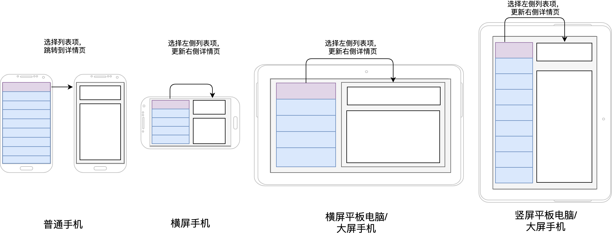

# 极客时间 [《Flutter核心技术与实战》](https://time.geekbang.org/column/article/104040)：Flutter屏幕适配

国际化为全世界的用户提供了统一而标准的体验。那么，为不同尺寸、不同旋转方向的手机提供统一而标准的体验，就是屏幕适配需要解决的问题了。

## 1 为什么需要适配

1. 不同的手机屏幕尺寸差别很大，应用有可能运行在屏幕更大的平板上。
2. 由于平板电脑的屏幕非常大，展示适配普通手机的界面和控件时，可能会出现 UI 异常的情况。比如，对于新闻类手机应用来说，通常会有新闻列表和新闻详情两个页面，如果我们把这两个页面原封不动地搬到平板电脑上，就会出现控件被拉伸、文字过小过密、图片清晰度不够、屏幕空间被浪费的异常体验。
3. 即使对于同一台手机或平板电脑来说，屏幕的宽高配置也不是一成不变的。因为加速度传感器的存在，所以当我们旋转屏幕时，屏幕宽高配置会发生逆转，即垂直方向与水平方向的布局行为会互相交换，从而导致控件被拉伸等 UI 异常问题。

因此：为了让用户在不同的屏幕宽高配置下获得最佳的体验，我们不仅需要对平板进行屏幕适配，充分利用额外可用的屏幕空间，也需要在屏幕方向改变时重新排列控件。即，我们需要优化应用程序的界面布局，为用户提供新功能、展示新内容，以将拉伸变形的界面和控件替换为更自然的布局，将单一的视图合并为复合视图。

在原生 Android 或 iOS 中，这种在同一页面实现不同布局的行为，我们通常会准备多个布局文件，通过判断当前屏幕分辨率来决定应该使用哪套布局方式。在 Flutter 中，屏幕适配的原理也非常类似，只不过 Flutter 并没有布局文件的概念，我们需要准备多个布局来实现。

## 2 适配屏幕旋转

为了适配竖屏模式与横屏模式，我们需要准备两个布局方案，一个用于纵向，一个用于横向。

当设备改变方向时，Flutter 会通知我们重建布局：Flutter 提供的 OrientationBuilder 控件，可以在设备改变方向时，通过 builder 函数回调告知其状态。这样，我们就可以根据回调函数提供的 orientation 参数，来识别当前设备究竟是处于横屏（landscape）还是竖屏（portrait）状态，从而刷新界面。

```dart
@override
Widget build(BuildContext context) {
  return Scaffold(
    // 使用 OrientationBuilder 的 builder 模式感知屏幕旋转
    body: OrientationBuilder(
      builder: (context, orientation) {
        // 根据屏幕旋转方向返回不同布局行为
        return orientation == Orientation.portrait
            ? _buildVerticalLayout()
            : _buildHorizontalLayout();
      },
    ),
  );
}
```

OrientationBuilder 提供了 orientation 参数可以识别设备方向，而如果我们在 OrientationBuilder 之外，希望根据设备的旋转方向设置一些组件的初始化行为，也可以使用 MediaQueryData 提供的 orientation 方法：

```dart
if(MediaQuery.of(context).orientation == Orientation.portrait) {
  //dosth
}
```

Flutter 应用默认支持竖屏和横屏两种模式。如果我们的应用程序不需要提供横屏模式，也可以直接调用 SystemChrome 提供的 setPreferredOrientations 方法告诉 Flutter，这样 Flutter 就可以固定视图的布局方向了：

```dart
SystemChrome.setPreferredOrientations([DeviceOrientation.portraitUp]);
```

## 3 适配平板电脑

为了充分利用平板的空间，可以将屏幕空间划分为多个窗格，即采用与原生 Android、iOS 类似的 Fragment、ChildViewController 概念，来抽象独立区块的视觉功能。

多窗格布局可以在平板电脑和横屏模式上，实现更好的视觉平衡效果，增强 App 的实用性和可读性。也可以通过独立的区块，在不同尺寸的手机屏幕上快速复用视觉功能。

如下图所示，分别展示了普通手机、横屏手机与平板电脑，如何使用多窗格布局来改造新闻列表和新闻详情交互：



要做到这种布局，就需要知道当前屏幕的尺寸，为了获取屏幕宽度，我们可以使用 MediaQueryData 提供的 size 方法。

```dart
if(MediaQuery.of(context).size.width > 480) {
  //tablet
} else {
  //phone
}
```

如果是 phone，就是用两个 Widget 来实现界面跳转：

```dart
/ 列表 Widget
class ListWidget extends StatefulWidget {
  final ItemSelectedCallback onItemSelected;
  ListWidget(
    this.onItemSelected,// 列表被点击的回调函数
  );
  @override
  _ListWidgetState createState() => _ListWidgetState();
}
 
class _ListWidgetState extends State<ListWidget> {
  @override
  Widget build(BuildContext context) {
    // 创建一个 20 项元素的列表 
    return ListView.builder(
      itemCount: 20,
      itemBuilder: (context, position) {
        return ListTile(
            title: Text(position.toString()),// 标题为 index
            onTap:()=>widget.onItemSelected(position),// 点击后回调函数
        );
      },
    );
  }
}
 
// 详情 Widget
class DetailWidget extends StatefulWidget {
  final int data; // 新闻列表被点击元素索引
  DetailWidget(this.data);
  @override
  _DetailWidgetState createState() => _DetailWidgetState();
}
 
class _DetailWidgetState extends State<DetailWidget> {
  @override
  Widget build(BuildContext context) {
    return Container(
      color: Colors.red,// 容器背景色
      child: Center(
        child: Column(
          mainAxisAlignment: MainAxisAlignment.center,
          children: <Widget>[
            Text(widget.data.toString()),// 居中展示列表被点击元素索引
          ],
        ),
      ),
    );
  }
}
```

如果是 tablet，则直接在一个界面展示列表和详情：

```dart
class _MasterDetailPageState extends State<MasterDetailPage> {
  var selectedValue = 0;
  @override
  Widget build(BuildContext context) {
    return Scaffold(
      body: OrientationBuilder(builder: (context, orientation) {
        // 平板或横屏手机，页面内嵌列表 ListWidget 与详情 DetailWidget
        if (MediaQuery.of(context).size.width > 480) {
          return Row(children: <Widget>[
            Expanded(
              child: ListWidget((value) {// 在列表点击回调方法中刷新右侧详情页
                setState(() {selectedValue = value;});
              }),
            ),
            Expanded(child: DetailWidget(selectedValue)),
          ]);
 
        } else {// 普通手机，页面内嵌列表 ListWidget
          return ListWidget((value) {// 在列表点击回调方法中打开详情页 DetailWidget
            Navigator.push(context, MaterialPageRoute(
              builder: (context) {
                return Scaffold(
                  body: DetailWidget(value),
                );
              },
            ));
 
          });
        }
      }),
    );
  }
}
```

## 4 总结

1. 通过 OrientationBuilder 提供的 orientation 回调参数，以及 MediaQueryData 提供的屏幕尺寸，以多窗格布局的方式为不同设备提供不同的页面呈现形态，能够大大降低编写独立布局所带来的重复工作。
2. 如果你的应用不需要支持设备方向，也可以通过 SystemChrome 提供的 setPreferredOrientations 方法，强制竖屏。

## 5 相关示例

- [33_multi_screen_demo](https://github.com/cyndibaby905/33_multi_screen_demo)

## 6 思考题

setPreferredOrientations 方法是全局生效的，如果你的应用程序中有两个相邻的页面，页面 A 仅支持竖屏，页面 B 同时支持竖屏和横屏，你会如何实现呢？
