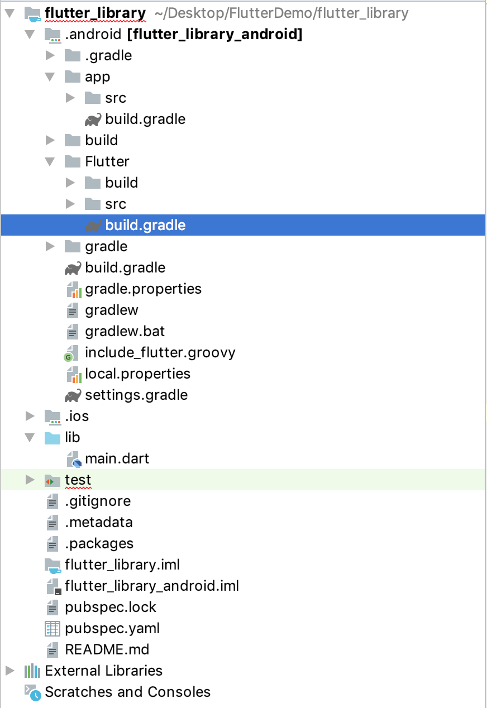

# 极客时间 [《Flutter核心技术与实战》](https://time.geekbang.org/column/article/104040)：混合开发-原生应用中混编Flutter工程

背景：

1. 对于成熟产品来说，完全摒弃原有 App 的历史沉淀，而全面转向 Flutter 并不现实。
2. 用 Flutter 去统一 iOS/Android 技术栈，把它**作为已有原生 App 的扩展能力**，通过逐步试验有序推进从而提升终端开发效率，可能才是现阶段 Flutter 最具吸引力的地方。

问题：

1. Flutter 工程与原生工程该如何组织管理？
2. 不同平台的 Flutter 工程打包构建产物该如何抽取封装？
3. 封装后的产物该如何引入原生工程？
4. 原生工程如何使用封装后的 Flutter 能力？

下面以一个实际示例来解答这戏问题。

## 1 原生工程准备

首先，我们分别用 Xcode 与 Android Studio 快速建立一个只有首页的基本工程，工程名分别为：

- iOSDemo
- AndroidDemo

这时 Android 工程就已经准备好了，对于 IOS 工程还需要做以下工作：

对于 iOS 工程来说，由于基本工程并不支持以组件化的方式管理项目，因此我们还需要多做一步，将其改造成使用 CocoaPods 管理的工程，也就是要在 iOSDemo 根目录下创建一个只有基本信息的 Podfile 文件：

```pod
use_frameworks!
platform :ios, '8.0'
target 'iOSDemo' do
#todo
end
```

然后，在命令行输入 pod install 后，会自动生成一个 iOSDemo.xcworkspace 文件，这时就完成了 iOS 工程改造。

## 2 Flutter 混编方案介绍

目前，在已有的原生 App 里嵌入一些 Flutter 页面，有两个办法：

1. 将原生工程作为 Flutter 工程的子工程，由 Flutter 统一管理。这种模式，就是统一管理模式。
2. 将 Flutter 工程作为原生工程共用的子模块，维持原有的原生工程管理方式不变。这种模式，就是三端分离模式。


### 统一管理模式

由于 Flutter 早期提供的混编方式能力及相关资料有限，国内较早使用 Flutter 混合开发的团队大多使用的是统一管理模式。

**缺点**：随着功能迭代的深入，这种方案的弊端也随之显露，不仅三端（Android、iOS、Flutter）代码耦合严重，相关工具链耗时也随之大幅增长，导致开发效率降低。

### 三端分离模式

后续使用 Flutter 混合开发的团队陆续按照三端代码分离的模式来进行依赖治理，实现了 Flutter 工程的轻量级接入

**优点**：

1. 轻量级接入
2. 三端代码分离模式把 Flutter 模块作为原生工程的子模块，还可以快速实现 Flutter 功能的“热插拔”，降低原生工程的改造成本。
3. Flutter 工程通过 Android Studio 进行管理，无需打开原生工程，可直接进行 Dart 代码和原生代码的开发调试。

三端工程分离模式的关键是抽离 Flutter 工程，将不同平台的构建产物依照标准组件化的形式进行管理：

- Android 使用 aar
- iOS 使用 pod

下面介绍三端分离模式实现混合开发

## 3 集成 Flutter

### 3.1 Flutter 模块开发

**默认的 Flutter 工程结构不适用于模块开发**：Flutter 的工程结构比较特殊，包括 Flutter 工程和原生工程的目录（即 iOS 和 Android 两个目录）。在这种情况下，原生工程就会依赖于 Flutter 相关的库和资源，从而无法脱离父目录进行独立构建和运行。

原生工程对 Flutter 的依赖主要分为两部分：

1. Flutter 库和引擎，也就是 Flutter 的 Framework 库和引擎库；
2. Flutter 工程，也就是我们自己实现的 Flutter 模块功能，主要包括 Flutter 工程 lib 目录下的 Dart 代码实现的这部分功能。

**创建 Flutter 模块工程**：在已经有原生工程的情况下，我们需要在同级目录创建 Flutter 模块，构建 iOS 和 Android 各自的 Flutter 依赖库。Flutter 为我们提供相关命令。我们只需要在原生项目的同级目录下，执行 Flutter 命令创建名为 Flutter_library 的模块即可：

```shell
Flutter create -t module flutter_library
```

待命令运行结束，会创建出一个 flutter_library 工程，我们可以用 AndroidStudio 打开：



模块工程有以下特点：

1. 和传统的 Flutter 工程相比，Flutter 模块工程也有内嵌的 Android 工程与 iOS 工程，因此我们可以像普通工程一样使用 Android Studio 进行开发调试。
2. Android 工程下多了一个 Flutter 目录，这个目录下的 build.gradle 配置就是我们构建 aar 的打包配置。这就是模块工程既能像 Flutter 传统工程一样使用 Android Studio 开发调试，又能打包构建 aar 与 pod 的秘密。
3. iOS 工程的目录结构也有细微变化，但这个差异并不影响打包构建。

接着，打开 main.dart 文件，将其逻辑更新为以下代码逻辑

```dart
import 'package:flutter/material.dart';
import 'dart:ui';

void main() => runApp(_widgetForRoute(window.defaultRouteName));// 独立运行传入默认路由

// 我们创建的 Widget 实际上是包在一个 switch-case 语句中的。
// 这是因为封装的 Flutter 模块一般会有多个页面级 Widget，原生 App 代码则会通过传入路由标识字符串，告诉 Flutter 究竟应该返回何种 Widget。
Widget _widgetForRoute(String route) {
  switch (route) {
    default:
      return MaterialApp(
        home: Scaffold(
          backgroundColor: const Color(0xFFD63031),//ARGB 红色
          body: Center(
            child: Text(
              'Hello from Flutter', // 显示的文字
              textDirection: TextDirection.ltr,
              style: TextStyle(
                fontSize: 20.0,
                color: Colors.blue,
              ),
            ),
          ),
        ),
      );
  }
}
```

接下来需要构建出对应的 Android 和 iOS 依赖库，实现原生工程的接入。

### 3.2 Android 模块集成

原生工程对 Flutter 的依赖主要分为两部分，对应到 Android 平台，这两部分分别是：

1. Flutter 库和引擎，也就是 icudtl.dat、libFlutter.so，还有一些 class 文件。这些文件都封装在 Flutter.jar 中。
2. Flutter 工程产物，主要包括应用程序数据段 isolate_snapshot_data、应用程序指令段 isolate_snapshot_instr、虚拟机数据段 vm_snapshot_data、虚拟机指令段 vm_snapshot_instr、资源文件 Flutter_assets。

搞清楚 Flutter 工程的 Android 编译产物之后，我们对 Android 的 Flutter 依赖抽取步骤如下：

- 1 在 Flutter_library 的根目录下，执行 aar 打包构建命令：`flutter build aar`。这条命令的作用是编译工程产物，并将 Flutter.jar 和工程产物编译结果封装成一个 aar。

- 2 打包构建的 aar 位于 `build/host/outputs/repo` 目录下，打包构建完之后，命令窗口会输出如下提示：

```groovy
Consuming the Module

  1. Open <host>\app\build.gradle
  2. Ensure you have the repositories configured, otherwise add them:

      repositories {
        maven {
            url 'D:\code\github\Programming-Notes\Flutter\Code\Hybrid\flutter_library\build\host\outputs\repo'
        }
        maven {
            url 'http://download.flutter.io'
        }
      }

  3. Make the host app depend on the Flutter module:

    dependencies {
      debugImplementation 'com.example.flutter_library:flutter_debug:1.0
      profileImplementation 'com.example.flutter_library:flutter_profile:1.0
      releaseImplementation 'com.example.flutter_library:flutter_release:1.0
    }


  4. Add the `profile` build type:

    android {
      buildTypes {
        profile {
          initWith debug
        }
      }
    }

To learn more, visit https://flutter.dev/go/build-aar
```

- 3 按照上面配置，在原生工程 Activity 中使用 aar 中的功能：

```java

import android.os.Bundle
import android.view.View
import androidx.appcompat.app.AppCompatActivity
import io.flutter.embedding.android.FlutterActivity

class MainActivity : AppCompatActivity() {

    override fun onCreate(savedInstanceState: Bundle?) {
        super.onCreate(savedInstanceState)
        setContentView(R.layout.activity_main)
    }

    fun openFlutter(view: View) {
        FlutterActivity.withNewEngine().initialRoute("page name").build(this)
            .run {
                startActivity(this)
            }
    }

}
```

至此，Android 工程接入完成。

### 3.3 iOS 模块集成

iOS 工程接入的情况要稍微复杂一些。在 iOS 平台，原生工程对 Flutter 的依赖分别是：

- Flutter 库和引擎，即 Flutter.framework；
- Flutter 工程的产物，即 App.framework。

iOS 平台的 Flutter 模块抽取，实际上就是通过打包命令生成这两个产物，并将它们封装成一个 pod 供原生工程引用。

- 1 首先我们在 Flutter_library 的根目录下，执行 iOS 打包构建命令：`Flutter build ios --debug`，这条命令的作用是编译 Flutter 工程生成两个产物：Flutter.framework 和 App.framework。同样，把 debug 换成 release 就可以构建 release 产物（当然，你还需要处理一下签名问题）。

- 2 其次，在 iOSDemo 的根目录下创建一个名为 FlutterEngine 的目录，并把这两个 framework 文件拷贝进去。iOS 的模块化产物工作要比 Android 多一个步骤，因为我们需要把这两个产物手动封装成 pod。因此，我们还需要在该目录下创建 FlutterEngine.podspec，即 Flutter 模块的组件定义：

```pod
Pod::Spec.new do |s|
  s.name             = 'FlutterEngine'
  s.version          = '0.1.0'
  s.summary          = 'XXXXXXX'
  s.description      = <<-DESC
TODO: Add long description of the pod here.
                       DESC
  s.homepage         = 'https://github.com/xx/FlutterEngine'
  s.license          = { :type => 'MIT', :file => 'LICENSE' }
  s.author           = { 'chenhang' => 'hangisnice@gmail.com' }
  s.source       = { :git => "", :tag => "#{s.version}" }
  s.ios.deployment_target = '8.0'
  s.ios.vendored_frameworks = 'App.framework', 'Flutter.framework'
end
```

- 3 pod lib lint 一下，Flutter 模块组件就已经做好了。趁热打铁，我们再修改 Podfile 文件把它集成到 iOSDemo 工程中：

```shell
...
target 'iOSDemo' do
    pod 'FlutterEngine', :path => './'
end
```

- 4 ，然后 pod install 一下，Flutter 模块就集成进 iOS 原生工程中了。

- 5 再次，我们试着修改一下 AppDelegate.m 的代码，把 window 的 rootViewController 改成 FlutterViewController：

```oc
- (BOOL)application:(UIApplication *)application didFinishLaunchingWithOptions:(NSDictionary *)launchOptions
 
{
    self.window = [[UIWindow alloc] initWithFrame:[UIScreen mainScreen].bounds];
    FlutterViewController *vc = [[FlutterViewController alloc]init];
    [vc setInitialRoute:@"defaultRoute"]; // 路由标识符
    self.window.rootViewController = vc;
    [self.window makeKeyAndVisible];
    return YES;
}
```

至此，IOS 工程接入完成。

## 4 总结

原生工程混编 Flutter 的方式有两种（目前，业界采用的基本都是第二种方式）。

- 一种是，将 Flutter 工程内嵌 Android 和 iOS 工程，由 Flutter 统一管理的集中模式；
- 另一种是，将 Flutter 工程作为原生工程共用的子模块，由原生工程各自管理的三端工程分离模式。

对于三端工程分离模式最主要的则是抽离 Flutter 工程，将不同平台的构建产物依照标准组件化的形式进行管理，即：

- 针对 Android 平台打包构建生成 aar，通过 build.gradle 进行依赖管理；
- 针对 iOS 平台打包构建生成 framework，将其封装成独立的 pod，并通过 podfile 进行依赖管理。

**更好的实践——CI 自动构建框架**：通过分离 Android、iOS 和 Flutter 三端工程，抽离 Flutter 库和引擎及工程代码为组件库，以 Android 和 iOS 平台最常见的 aar 和 pod 形式接入原生工程，我们就可以低成本地接入 Flutter 模块，愉快地使用 Flutter 扩展原生 App 的边界了。但如果每次通过构建 Flutter 模块工程，都是手动搬运 Flutter 编译产物，那很容易就会因为工程管理混乱导致 Flutter 组件库被覆盖，从而引发难以排查的 Bug。而要解决此类问题的话，我们可以引入 CI 自动构建框架，把 Flutter 编译产物构建自动化，原生工程通过接入不同版本的构建产物，实现更优雅的三端分离模式。

## 5 相关示例

- [28_module_page](https://github.com/cyndibaby905/28_module_page)
- [28_iOSDemo](https://github.com/cyndibaby905/28_iOSDemo)
- [28_AndroidDemo](https://github.com/cyndibaby905/28_AndroidDemo)

## 6 思考题

对于有资源依赖的 Flutter 模块工程而言，其打包构建的产物，以及抽离 Flutter 组件库的过程会有什么不同吗？

## 7 说明

由于 Flutter SDK 升级到 1.12 后，有很多不兼容的更新，原文所述集成方式可能不再适用，因此在原文基础上做了适当修改，具体参考：

- [flutter-io-flutter-facade-not-found](https://stackoverflow.com/questions/59367636/flutter-io-flutter-facade-not-found)
- [Add Flutter to existing app](https://flutter.dev/docs/development/add-to-app)
