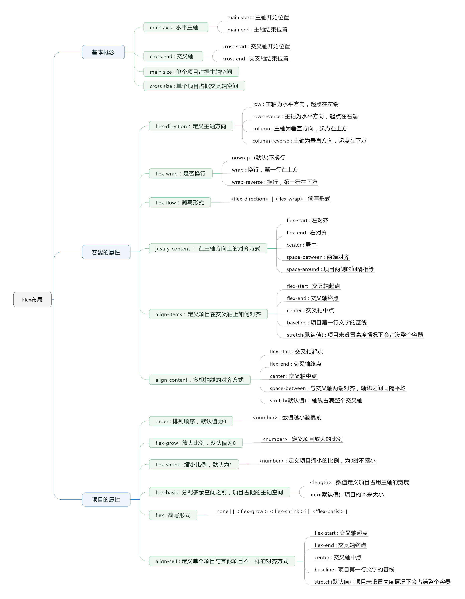

# Flex 布局

CSS3 弹性盒子(Flexible Box 或 Flexbox)，是一种用于在页面上布置元素的布局模式，使得当页面布局必须适应不同的屏幕尺寸和不同的显示设备时，元素可预测地运行。对于许多应用程序，弹性盒子模型提供了对块模型的改进，因为它不使用浮动，flex容器的边缘也不会与其内容的边缘折叠。
 
弹性盒模型，分老版与新版

- 老版本的我们通常称之为 box
- 新版本的我们通常称之为 flex（新版本比老版本要强大的很多，为什么还需要老版本？因为很多移动端浏览器内核版本都比较低，只支持老版本的弹性盒子）
 
## 1 老版本 Flex 布局

老版本 Flex 布局容器设置 display 为 webkit-box。

容器控制：

- 容器的布局方向：`-webkit-box-orient:horizontal/vertical`，控制主轴是哪一根
    - horizontal：x轴
    - vertical  ：y轴
- 容器的排列方向：`-webkit-box-direction：normal/reverse`，控制主轴的方向
    - normal：从左往右（正方向）
    - reverse：从右往左（反方向）
- 富裕空间的管理：只决定富裕空间的位置，不会给项目区分配空间
    - 主轴：`-webkit-box-pack`
    - 侧轴：`-webkit-box-algin`

富裕空间主轴控制：

- start：富裕空间在右边
- end：富裕空间在左边
- center：富裕空间在两边
- justify：富裕空间在项目之间
				
富裕空间侧轴控制：

- start：富裕空间在右边
- end：富裕空间在左边
- center：富裕空间在两边

弹性空间的管理：将富裕空间按比例分配到各个项目上
			
- `-webkit-box-flex`：弹性因子（默认值为0），弹性空间按弹性因子权重分配到项目上。

**老版本 Flex 布局，没有侧轴方向的概念，子元素排列超出父元素范围后会溢出，而不会自动换行。**

## 2 新版本 Flex 布局

老版本 Flex 布局容器设置 display 为 `-webkit-flex` 或者 `flex`

容器控制：

- 容器的布局方向：`-webkit-box-orient:horizontal/vertical`，控制主轴是哪一根
    - horizontal：x轴
    - vertical：y轴
- 容器的排列方向：`-webkit-box-direction：normal/reverse`，控制主轴的方向
    - normal：从左往右（正方向）
    - reverse：从右往左（反方向）
- 富裕空间的管理：只决定富裕空间的位置，不会给项目区分配空间
    - 主轴：`justify-content`
    - 侧轴：`align-items`

富裕空间主轴控制：

- flex-start：富裕空间在主轴的正方向
- flex-end：富裕空间在主轴的反方向
- center：富裕空间在主轴的两边
- space-between：富裕空间在项目之间
- space-around(老版本没有)：富裕空间在项目两边
				
富裕空间侧轴控制：

- flex-start：富裕空间在侧轴的正方向;
- flex-end：富裕空间在侧轴的反方向;
- content：富裕空间在侧轴的两边;
- baseline(老版本没有)：按基线对齐
- stretch(老版本没有)：拉伸元素，可以用于实现等高布局(不设置元素 height 情况下)

弹性空间的管理：将富裕空间按比例分配到各个项目上
			
- `flex-grow`：弹性因子，默认值为 0，弹性空间按弹性因子权重分配到项目上。

## 3 新版 flex 布局详解

### flex-wrap

flex-wrap 属性控制了容器为单行/列还是多行/列。并且定义了侧轴的方向，新行/列将沿侧轴方向堆砌。默认值：`nowrap`；该属性不可继承。
 
可选值：

- nowrap 不换行(项目挤压)。
- wrap 换行。
- wrap-reverse 换行，且反向。

### align-content

align-content 属性定义弹性容器的侧轴方向上有额外空间时，如何排布每一行/列。当弹性容器只有一行/列时无作用，多行多列时会把所有行、列看成一个整体，默认值：stretch，该属性不可继承。
 
可选值：

- `flex-start`：所有行/列从侧轴起点开始填充。第一行/列的侧轴起点边和容器的侧轴起点边对齐。接下来的每一行/列紧跟前一行/列。
- `flex-end`：所有弹性元素从侧轴末尾开始填充。最后一个弹性元素的侧轴终点和容器的侧轴终点对齐。同时所有后续元素与前一个对齐。
- `center`：所有行/列朝向容器的中心填充。每行/列互相紧挨，相对于容器居中对齐。容器的侧轴起点边和第一行/列的距离相等于容器的侧轴终点边和最后一行/列的距离。
- `space-between`：所有行/列在容器中平均分布。相邻两行/列间距相等。容器的侧轴起点边和终点边分别与第一行/列和最后一行/列的边对齐。
- `space-around`：所有行/列在容器中平均分布，相邻两行/列间距相等。容器的侧轴起点边和终点边分别与第一行/列和最后一行/列的距离是相邻两行/列间距的一半。
- `stretch`：拉伸所有行/列来填满剩余空间。剩余空间平均的分配给每一行/列
 
align-content 起作用的前提是必须有 flex-wrap 属性，而且该属性值必须不为 nowrap。

### flex-flow

flex-flow 属性是设置 “flex-direction” 和 “flex-wrap” 的简写，默认值为：`row nowrap`，该不可继承，控制主轴和侧轴的位置以及方向。

### order

order 属性规定了弹性容器中的可伸缩项目在布局时的顺序。元素按照 order 属性的值的增序进行布局。拥有相同 order 属性值的元素按照它们在源代码中出现的顺序进行布局，order越大越后，默认值为 0，该属性不可继承。

### align-self

align-self 会对齐当前 flex 行中的 flex 元素，并覆盖 align-items 的值. 如果任何 flex 元素的侧轴方向 margin 值设置为 auto，则会忽略 align-self。默认值为`auto`，该属性不可继承。
 
可选值：

- `auto`：设置为父元素的 align-items 值，如果该元素没有父元素的话，就设置为 stretch。
- `flex-start`：flex 元素会对齐到 cross-axis(侧轴) 的首端。
- `flex-end`：flex 元素会对齐到 cross-axis 的尾端。
- `center`：flex 元素会对齐到 cross-axis 的中间，如果该元素的 cross-size 的尺寸大于 flex 容器，将在两个方向均等溢出。
- `baseline`：所有的 flex 元素会沿着基线对齐，
- `stretch`：flex 元素将会基于容器的宽和高，按照自身 margin box 的 cross-size 拉伸

### flex-grow、flex-shrink 与 flex-basis

 - flex-grow 属性定义弹性盒子项（flex item）的拉伸因子。
 - flex-shrink 属性指定了 flex 元素的收缩因子，默认值为1

flex-basis 指定了 flex 元素在主轴方向上的初始大小，默认值为 `auto`，不可继承，**注意，在 flex 简写属性中 flex-basis的默认值为 0**。当 flex-basis 为 auto 时，其值为元素自身在主轴方向上的 size，比如主轴为横轴，width = 50px，那么 flex-basis  就为 50px。
 
flex-grow 计算规则：

```
   可用空间 = (容器大小 - 所有相邻项目 flex-basis 的总和)
   可扩展空间 = (可用空间/所有相邻项目 flex-grow 的总和)
   每项伸缩大小 = (伸缩基准值 + (可扩展空间 x flex-grow 值))
```

flex-shrink 计算规则：

```
并不是：每项 flex 收缩大小 = 伸展基准值 - (收缩比例 / 收缩比例总和 x 溢出的空间)

而是：
   1.计算收缩因子与基准值乘的总和
   2.计算收缩因数：收缩因数 =（项目的收缩因子 * 项目基准值）/第一步计算总和    
   3.移除空间的计算：移除空间 = 项目收缩因数 x 负溢出的空间
        负溢出的空间 = 父元素大小 - 相邻项目伸展基准值之和
   4.元素最终大小：元素最终大小 = 伸展基准值 - 移除空间
```

### flex

flex 是 flex-grow，flex-shrink，flex-basis 的简写属性，该属性不可继承。

默认值  

```css
flex-grow: 0
flex-shrink: 1
flex-basis: auto
```

可选值

```
    flex: none;/* 0 0 auto */
    flex：1;/* 1 1 0% */
```

## 4 应用场景

### 等分布局

```css
flex-shrink: 1;
flex-grow: 1;
flex-basis: 0;
```

等同于

```css
flex : 1;
```

## 4 总结



## 5 可参考资料

- [阮一峰：Flex 布局教程：语法篇](http://www.ruanyifeng.com/blog/2015/07/flex-grammar.html)
- [阮一峰：Flex 布局教程：示例篇](http://www.ruanyifeng.com/blog/2015/07/flex-examples.html)
- [Flex 布局练习](http://flexboxfroggy.com/)