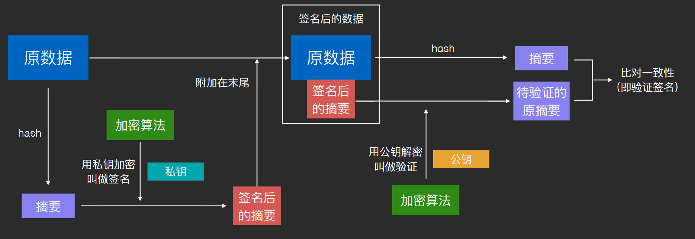

# 密码学

## 1 古代密码学

起源：

- 古代战争，防止战争信息被对方获取，对信使传输的内容进行加密。

加密算法：

- 移位式加密
- 替换式加密

## 2 现代密码学

- 随着计算机的出现，计算能力越来越强
- 不止可以用于⽂字内容，还可以用于各种⼆进制数据。
- ⾮对称加密的出现使得密码学有了更广泛的用途：数字签名

### 对称加密

- 原理：使⽤**密钥**和**加密算法**对数据进行转换，得到的无意义数据即为密文；使用密钥和解密算法对密文进行逆向转换，得到原数据。
- 经典算法：
  - DES（56 位密钥，密钥太短⽽逐渐被弃用）。
  - AES（128 位、192 位、256 位密钥，现在广泛使用）。
- 对称加密的破解思路：拿到⼀组或多组`原文-密文对`，设法找到一个密钥，这个密钥可以将这些原文-密⽂对中的原⽂加密为密文，以及将密文解密为原文的组合，即为成功破解
- 对称加密防破解思路：让破解者找不到⽐穷举法更有效的破解手段。
- 对称加密的缺点：不能在不安全的网络上传输密钥，⼀旦密钥泄露则加密通信失败。

### 非对称加密

- 原理：使⽤**公钥**对数据进行加密得到密⽂；使⽤**私钥**对数据进行解密得到原数据。

使用非对称加密进行通信：

- 通信的双方都有自己的公钥和私钥，并且都公开自己的公钥。
- A 拿到 B 的公钥，使用 B 的公钥加密数据后传给 B，只有 B 能解密看到。
- B 拿到 A 的公钥，收到消息后，进行回复，使用 A 的公钥加密数据后传给 A，只有 A 能解密看到。
- 非对称加密通信的顺序是，**用公钥加密，用私钥解密**。

使用非对称加密进行通信的问题：

- 非对称加密可以保证数据安全性，通信的双方各自保留自己的私钥，保留自己的公钥。
- 使用非对称加密的认值问题：
  - 不能确认数据确实来自认为的那个人，公钥的传输是不受包括的。
  - 不能保证数据的完整性，攻击者可以修改密文，而接收者无法侦测到数据被修改了。
- 计算复杂，因此性能相⽐比对称加密差很多。

### 数字签名：签名和验证

- 由于私钥和公钥互相可解，因此非对称加密还可以应用于数字签名技术。
- 签名和验证的过程：
  - 签名：A 持有的特定的私钥，使用该私钥对 `原数据` 经过加密算法得出一个签名数据，这个过程就叫做签名。
  - A 可以将签名数据和原数据给需要进行验证的人。
  - 别人可以拿着 A 所持有私钥对应的公钥进行验证，拿着 A 的公钥解密 A 提供的签名数据，然后和 A 提供的原数据进行对比，如果一致，则能正确这个数据确实是 A 提供的，这个数据签名验证能证明这个数据确实是来自 A ，因为只有 A 持有那个私钥，只有 A 才能在造出这个签名。这个过程叫做验证。
- 签名和验证的顺序是，用私钥加密，他人用公钥验证。

上述方式有一个问题，如果原数据的数据量非常大，比如几个G，那么对这几个 G 的数据进行签名后得到的数据签名也有几个 G，然后要同时公布原数据和签名数据就会造成大量数据传输，所以改进的做法： `数字摘要 + 签名和验证`：

- 不直接对原数据进行签名，而是先对原数据进行摘要，再对摘要进行签名得到签名数据
- 验证方拿到原数据和数据签名：
  - 使用对方的公钥解密签名得到摘要 S1
  - 使用同样算法对原数据进行摘要得到 S2
  - 对比 S1 和 S2，如果一致，则说明该数据是来自 A 的。

签名和验证提供了以下性质：

1. 确认消息在传输过程中没有丢位，没被篡改（完整性）
2. 确认消息的发送者是发布公钥的所有者（认证）
3. 确认公钥的所有者的确发布过该消息（不可否认性）

具体参考[维基百科——数字签名](https://zh.wikipedia.org/wiki/%E6%95%B8%E4%BD%8D%E7%B0%BD%E7%AB%A0)

注意：数字签名本身并不关注数据的机密性，而是验证。

## 引用

- HencoderPlus 学习记录
