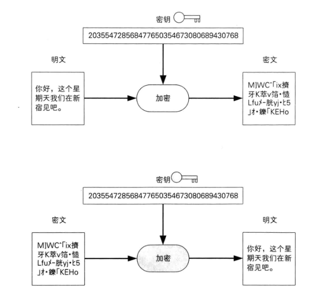
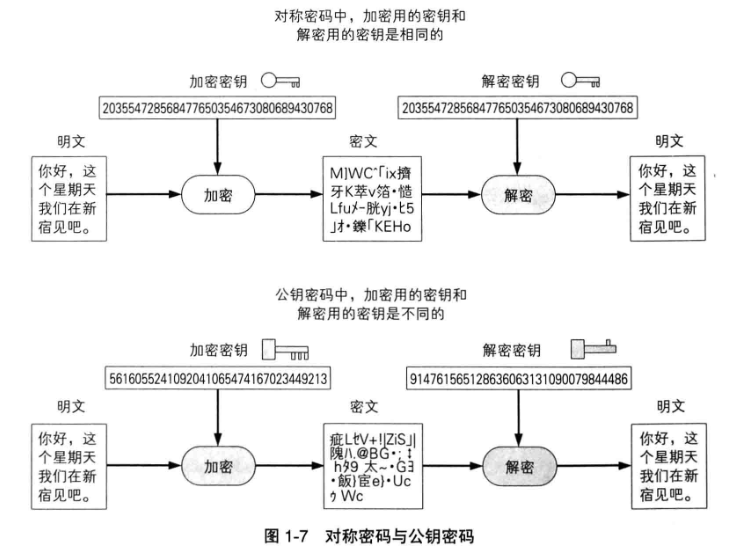
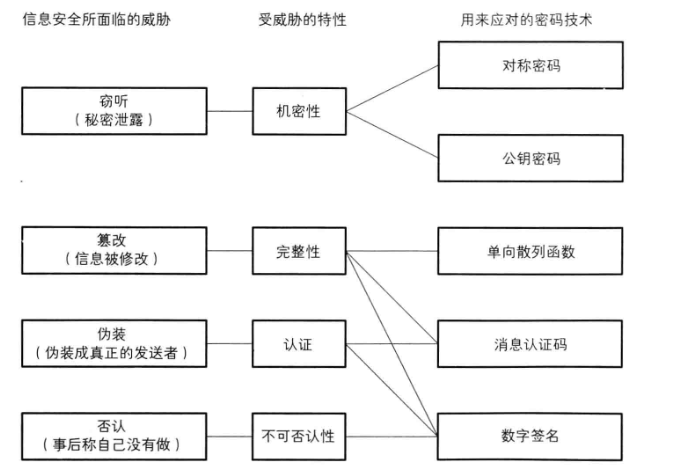

# 《图解密码技术》第一部分

---
## 说明

- 这是《图解密码技术》读书笔记
- 单纯学习密码技术理论知识可能比较枯燥，可以尝试使用编程语言来切实体验数据的加解密过程，比如 java 的 `javax.ecipher.*` 包中就提供了很多书中介绍的密码技术的实现。

---
## 1 环游密码世界——密码技术简介

### 密码学相关术语

- 发送者：比如邮件发件人
- 接收者：比如邮件收件人
- 加密：加密是一种行为，将明文转换为密文。
- 明文：加密前的数据。
- 密文：加密后的数据。
- 解密：正当的接收者将密文还原成明文。
- 密码破译(密码分析)：接收者之外的其他人试图将密文还原成明文。
- 密码算法：用于解决复杂问题的步骤，通常称为算法（ algorithm ），从明文生成密文的步骤，也就是加密的步骤，称为“加密算法"，而解密的步骤则称为“解密算法"。加密、解密的算法合在一起统称为密码算法。
- 密钥：密码算法需要密钥，区别于现实世界中的金属钥匙，密钥是一串字符。

### 密码技术所提供的特性

密码技术所提供的不仅仅是基于密码的**机密性**，用于检验消息是否被篡改的**完整性**，以及用确认对方是否是本人的**认证**等都是密码技术的重要部分。

- 机密性：只有通信双方才能看到真实的数据。
- 完整性：数据没有被篡改。
- 认证：能确认数据是所期望的通信对象发送的。

### 常见密码技术简介

#### 对称加密与公钥加密

根据密钥的使用方法，可以将密码分为对称密码和公钥密钥：

- 对称密码（symmetric cryptographic）：加密和解密过程使用同一密钥
- 公钥密码（public-key cryptographic）：在加密和解密的过程中使用不同的密钥，因此公钥密码也称为为非对称密码（asymmetric cryptographic）

另外，将对称密码和公钥密码结合起来的密码方式成为混合密码系统(hybrid cryptosystem)，比如 HTTPS 就使用了混合密码加密。

#### 单向散列函数

单向散列函数（one-way hash function）：散列值是用单向散列函数计算出来的值，单向散列函数所保证的并不是数据的机密性，而是**完整性**（integral），完整性是指数据是正牌的而不是伪造的，比如软件的发布者通常还会发布软件的散列值，以供用户验证这个软件是否是官方的没有被篡改过的。

- 单向散列函数是不可逆的，常用的算法有：MD5、SHA1、SHA256。
- 单向散列函数也叫消息摘要（Message digest）、指纹（Fingerprint）。
  
#### 消息认证码

消息认证码（message authentication code）：为了确认消息是否来自所期望的通信对象，可以使用消息认证码，通过消息认证码不仅可以确认消息是否被篡改，还能够确认消息是否来在所期待的通信对象。消息认证码不仅能够保证**完整性**，还能够提供**认证**（ authentication ）机制。

#### 数字签名

数字签名（digital signature）是能够防止伪装、篡改、否认的技术。

- 否认（republican）：事后推翻自己先前的主张的行为。比如某人冒充你的朋友与你进行通信进行欺骗，事后会否认他做了这件事。
- 篡改：篡改传输过程中的消息。
- 伪装：伪装成通信双方的某一方。

#### 伪随机数生成器  

伪随机数生成器（pseudo random number generator, PRNG）：是一种能够模拟产生随机数的算法，伪随机数承担着密钥生成的重要职责。在Web中进行SSL/TLS通信时，会生成一个仅用于当前通信的临时密钥（会话密钥），这个密钥就是基于伪随机数生成器生成的。如果生成随机数的算法不好，窃听者就能够推测出密钥，从而带来通信机密性下降的风险。

### 密码学家的工具箱

对称密码、公钥密码、单向散列函数、消息认证码、数字签名、伪随机数生成器技术统称为密码学家的工具箱。

不同的密码技术提供了不同的安全特性，将它们组合运用起来，就可以解决信息安全所面临的问题：

### 密码与信息安全常识

- **不要使用保密的密码算法**：从历史来看，密码算法的密码无一例外地都会被暴露出来。
- **开发高强度的密码算法是非常困难的**：要比较密码算法的强弱是非常困难的，密码算法的强度只能通过事实来证明，现在世界上公开的被认为强度较高的密码算法，几乎都是经过破译者长期尝试破译未果的情况下而存活下来的，因此，如果认为“公司自己开发的密码系统比那些公开的密码系统更强”，那只能说太高估自己公司的能力了。试图通过对密码算法本身进行保密来确保安全性的行为，一般称为隐蔽式安全性（security by obscurity），这种行为是危险而且愚蠢的。反过来将密码算法的详细信息以及程序源代码全部交给专业的破译者，并且提供大量明文和密码样本，如果在这样的情况向下破译一段新的密文依然需要花费较长的时间，就说明这是高强度的密码。
- **使用低强度的密码比不进行任何加密更危险**。此观点出自《密码故事》
- **任何密码总有一天会被破译**：无论加密算法多强，使用穷举法最终也能将其破译，因此破译密文所需的时间，与要保密的明文的价值之间的权衡就显得非常重要。另外虽然一次性密码本（one-time pad）是例外，但它并不是一种显示可用的算法。
- **密码只是信息安全的一部分**：最脆弱的环节并不是密码，而是人类自己，最近，社会工程学攻击（social engineering）也是比较流行的。

---
## 2 历史上的密码技术——密码技术的发展

### 历史上的密码技术

- **凯撒密码**：公元前100年，尤利乌斯-凯撒使用的密码，通过将明文中所使用的字母表按照一定的字数**平移**来进行加密。凯撒密码破解方法是穷举法，字母平移的可能数只有 25 种，非常容易破解。
- **简单替换密码**：将明文中所使用的字母表替换为另一套字母表的密码称为简单替换密码（simple substitute cipher）。简单密码很难通过暴力破解来进行破译。一种密码能够使用的所有的密钥集合称 **为密钥空间**，所有可能密钥的总数就是密钥空间的大小，密钥空间越大，暴力破解就越困难。可以使用**频率分析**来破解简单替换密码，频率分析利用了明文中的字母出现的频率和密文中字母出现的频率一致这一特性，比如英语中，某些单词（比如 the）出现的非常多。
- **Enigma**：Enigma 是由德国人阿瑟-谢尔比乌斯于20世纪发明的一种能够进行加密和解密操作的机器。

### 为什么密码算法和密钥要分开

对于上面介绍的加密方法，算法和密钥分别是：

- 凯撒密码：算法是经明文中的各个字母按照指定字母表进行平移，密钥是平移的字母表。
- 凯撒密码：算法是按照替换表对字母进行替换，密钥是替换表。
- 凯撒密码：算法是 Enigma 密码机，密钥是密码机的接线方式、转子的顺序和位置。

将密码算法和密钥分开的意义在于，**密码算法是需要重复使用的**，但在重复使用同一种密码算法的过程中，该算法被破译的可能性也逐渐增大，因此我们就在密码算法中准备了一些可变的部分，并在每次通信时都针对这些可变的部分进行改变，这一可比的部分就是密钥。

---
## 3 对称密码——共享密钥密码

### 从文字密码到比特序列密码

我们所使用的密码技术都是基于明文的比特序列进行加密的，而这离不开编码技术和XOR。

- **编码**：计算机世界操作的并不是文字，而是由 0 和 1 组成的比特序列，执行加密操作的程序，就是将表示明文的比特(bit)序列转换为表示密文的比特序列。将现实世界中的东西映射为比特序列称之为**编码（encoding）**。
- **XOR**：XOR 全称是 exclusive or，中文称之为亦或，一个比特序列亦或另一个等长的序列两次，得到的结果是其本身。XOR 是复杂的加密算法的组成部分。

### DES

DES（Data Encryption Standard）是 1977 年美国联邦信息处理标准中所采用的一种对称密码，DES 一直以来被美国以及其他国家的政府和银行使用，但是随着计算机的进步，DES 已经能够被暴力破解了。

- DES 是一种将 64 比特的明文密码加密成 64 比特密文的对称密码算法，虽然规格上使用 DES 需要 64 位长的密钥，但因为其密钥每 8 位包含 1 位纠错码，所以实质上的它的密钥长度是 56 比特。
- DES 是以 64 比特的明文为一个单位来进行加密的，这 64 比特单位称之为**分组**，一般来说，以分组为单位进行处理的密码算法称之为**分组密码**（block cipher）。
- DES 每次只能加密 64 比特数据，如果要加密的明文比较长，就需要对 DES 加密进行迭代，而具体的迭代方式就称之为**模式**。
- DES 的基本结构是由 Horst Feistel 设计的，因此也称之为 Feistel网络（Feistel network）、Feistel结构（Feistel structure）、Feistel密码（Feistel cipher）。在 Feistel 网络中，加密的各个步骤称为**轮**（round），整个加密过程就是进行若干次轮的循环。

### 3DES

三重DES（triple-DES）是为了增强 DES 的强度，将 DES 重复三次所得到的一种密码算法，也称为 TDEA（Triple Data Encryption Algorithm）。缩写为 3DES。

3DES 兼容 DES 密码算法，当 3DES 的三次加密都是用相同的密钥时，就等同于普通的 DES了。

- DES-EDE2：密钥1和密钥3使用相同的密钥，而密钥2使用不同的密钥。
- DES-EDE3：三次加密都使用不同的密钥。

尽管 3DES 目前还在被银行等机构所使用，但其处理速度不高，处理特别注重向下兼容性的情况下，很少被用于新的用途。

### AES

AES（Advanced Encrytion Standard）是取代前任标准 DES 而成为新的标准的一种对称加密算法。全世界的企业和密码学家提交了多个对称加密算法作为 AES 的候选，最终在 2000 年从这些候选算法中选出了一种名为 Rijndael 的对称密码算法，并将其确定为 AES。Rijndael 也是有多个轮组成，但 Rijndael 没有使用 Feistel 网络，而是使用了 SPN 结构。

### 应该使用哪种加密算法

- DES 不应该在用于任何新的用途。现在暴力破解法已经能够实现在现实时间内完成对 DES 的破解。
- 3DES 也没有足够的理由被用于新的用途，尽管一些特别注重向下兼容性的系统还在使用 3DES，但最终会被 AES 取代。
- AES 是合适的对称加密算法。不应该使用任何自制的加密算法。而是应该选用 AES。

---
## 4 分组密码的模式——分组密码是如何进行迭代的

DSE 和 AES 都属于分组密码，它们只能加密固定长度的明文，如果需要加密的信息的长度超过密钥的长度，就需要对分组密码进行迭代，而分组迭代的方式就是**模式**。

分组密码有很多种模式，如果模式选择不当无法充分保证机密性，分组密码的主要模式包括：ECB、CBC、CFB、OFB、CTR。

分组密码与流密码：

- 分组密码是指每次只能加密特定长度的一块数据的一类密码算法。
- 流密码是指对数据进行连续处理的一类密码算法。

ECB、CBC、CFB、OFB、CTR 分别是指：

- ECB（Electronic ChdeBook mode）电子密码模式
- CBC（Cipher Block Chaining mode）密码分组链接模式
- CFB（Cipher FeedBack mode）密文反馈模式
- OFB（Output FeedBack mode）输出反馈模式
- CTR（CounTeR mode）计数器模式

各个模式的特点：

- ECB：将明文分组加密后的结果直接称为密文分组，ECB是最简单的模式，存在一定风险，且攻击者可以在不破译密文的情况下操作明文。
- CBC：确保互联网安全的通信协议 SSL/TLS 就是使用的 CBC 模式来确保通信内容的机密性的。

---
## 5 公钥密码——非对称密码加密

### 密钥配送问题

在对称加密中，由于用于加密和解密的密钥是相同的，因此必须向接收者配送密钥，用于解密的密钥必须实现配送给接收者，者一问题称为密钥配送问题（key distribution problem）。有以下方法来安全地配送密钥：

- 通过事先共享密钥解决
- 通过密钥分配中心解决
- 通过 diff-hellman 密钥交换解决
- 通过公钥密码解决

解决方法与问题：

- 事先共享密钥：具有很大的局限性，相邻的人可以通过物理方式交换密钥，但是对于素未谋面的网友却不可行，且如果 A 需要和 1000 个人进行安全通信，那么就 A 需要维护 1000 个密钥。
- 密钥分配中心：密钥分配中心如果被入侵则所有信息都会泄露，另外如果通信需求非常对，密钥分配中心的压力也会很大。

### 公钥密码

可以说公钥密码（public-key cryptographic）是密码学史上最伟大的发明，密钥分为加密密钥和解密密钥两种，发送者用加密密钥对消息进行加密，接受者用解密密钥对密文进行解密，要理解公钥密码，清楚地区分加密密钥和解密密钥是非常重要的，加密密钥是发送者加密时使用的，而解密密钥是接收者解密时使用的。对比加密密钥和解密密钥，可以发现：

- 发送者只需要加密密钥
- 接收者只需要解密密钥
- 解密密钥不可以被窃听者获取
- 加密密钥被窃听者获取也没有问题

也就是说，解密密钥从一开始就是由接收者保管的，因此只要将加密密钥发给发送者就可以解决密钥配送的问题了，而根本不需要配送解密密钥，公钥密码中，加密密钥一般都是公开的，正是由于加密密钥可以任意公开，因此该密钥被称为公钥。

公钥密码无法解决的问题：

- **认证** 无法判断公钥是否合法正确，这个问题被称为公钥认证问题。
- **效率** 公钥密钥的处理速度只有对称密钥的几百分之一。

### RSA

- [ ] todo

---
## 6 混合密码系统

- [ ] todo
