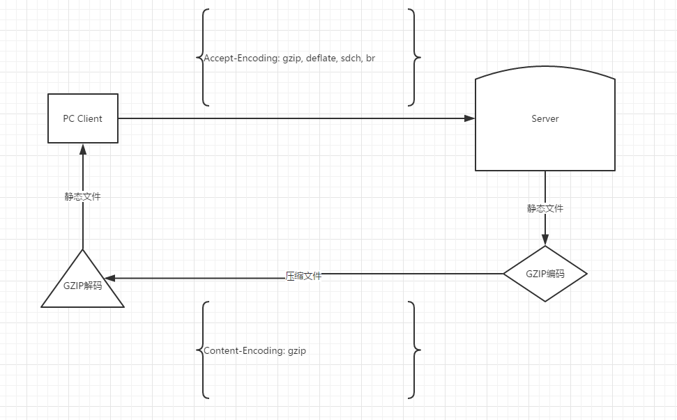
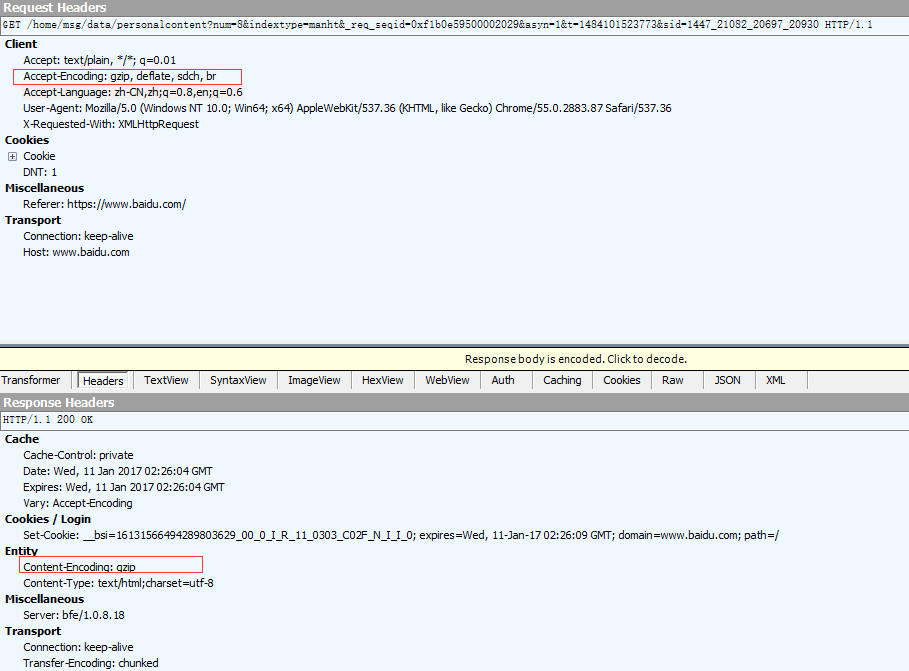

# Content-encoding

通过 Accept-Encoding 和 Content-encoding 客户端和服务端可以协商采用压缩的方式来进行内容传输，针对文本数据的压缩可以大大减少传输量的大小，从而提高响应速度，gzip 是常见的压缩方式。

gzip是**GNUzip**的缩写，最早用于UNIX系统的文件压缩。HTTP协议上的gzip编码是一种用来改进web应用程序性能的技术，web服务器和客户端（浏览器）必须共同支持gzip。目前主流的浏览器，Chrome,firefox,IE等都支持该协议。常见的服务器如Apache，Nginx，IIS同样支持gzip。

gzip压缩比率在3到10倍左右，可以大大节省服务器的网络带宽。而在实际应用中，并不是对所有文件进行压缩，通常只是压缩静态文件。

客户端和服务器之间是如何通信来支持 gzip 的呢？通过下图我们可以很清晰的了解。

1. 浏览器请求url，并在request header中设置属性`accept-encoding:gzip`。表明浏览器支持gzip。
1. 服务器收到浏览器发送的请求之后，判断浏览器是否支持**gzip**，如果支持**gzip**，则向浏览器传送压缩过的内容，不支持则向浏览器发送未经压缩的内容。一般情况下，浏览器和服务器都支持gzip，`response headers`返回包含`content-encoding:gzip。`
1. 浏览器接收到服务器的响应之后判断内容是否被压缩，如果被压缩则解压缩显示页面内容。

现在的浏览器一般都支持GZIP压缩，以Chrome为例进行测试，打开一个网址，通过抓包获取Header：

可以看到请求头中：`accept-encoding:gzip, deflate, sdch`，表明chrome浏览器支持这三种压缩。accept-encoding 中添加的另外两个压缩方式 deflate 和 sdch。deflate 与 gzip 使用的压缩算法几乎相同。sdch是**Shared Dictionary Compression over HTTP**的缩写，即通过字典压缩算法对各个页面中相同的内容进行压缩，减少相同的内容的传输。**sdch**是Google 推出的，目前只有 Google Chrome, Chromium 和 Android 支持。

通过网址 http://gzip.zzbaike.com/ 可以检测一个网站的GZIP压缩率：

---
## 引用

- [HTTP 内容编码，也就这 2 点需要知道 | 实用 HTTP](https://www.cnblogs.com/plokmju/p/http_gzip.html)
